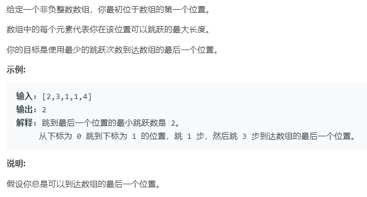

# 45.跳跃游戏 II (Hard)

## 题目描述



### 标签

贪心算法；

## 思路 & 代码

维护一个当前可达的最远位置，当到达末尾时返回即可。

```c++
int jump(vector<int>& nums)
{
    int ans = 0;
    int end = 0;
    int maxPos = 0;
    for (int i = 0; i < nums.size() - 1; i++)
    {
        maxPos = max(nums[i] + i, maxPos);
        if (i == end)
        {
            end = maxPos;
            ans++;
        }
    }
    return ans;
}
```