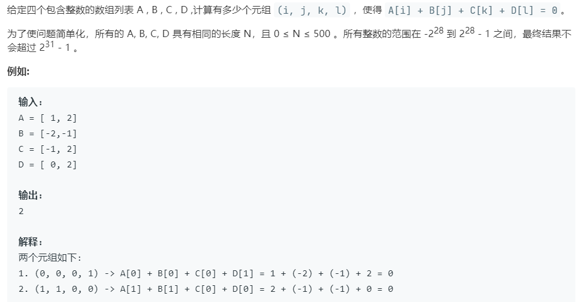

# 454.四数相加 II (Medium)

## 题目描述



### 标签

二分查找；

## 思路 & 代码

四个数组分别取一个元素使和为零，比较简单的方法就是先存一部分和，然后再算另一部分，四个数组最好是两个一组处理，这样时间复杂度 $O(n^2)$。

不用哈希的话就是两个一组求出和，然后遍历一个二分搜索另一个。

```c++ tab="哈希表"
class Solution {
public:
    int fourSumCount(vector<int>& A, vector<int>& B, vector<int>& C, vector<int>& D) {
        int n = A.size();
        int res = 0;
        if(n == 0) {
            return res;
        }
        unordered_map<int, int> sumMap;
        for(int i = 0; i < n; i++) {
            for(int j = 0; j < n; j++) {
                sumMap[A[i] + B[j]]++;
            }
        }
        for(int i = 0; i < n; i++) {
            for(int j = 0; j < n; j++) {
                int tar = - (C[i] + D[j]);
                if(sumMap.count(tar)) {
                    res += sumMap[tar];
                }
            }
        }
        return res;
    }
};
````