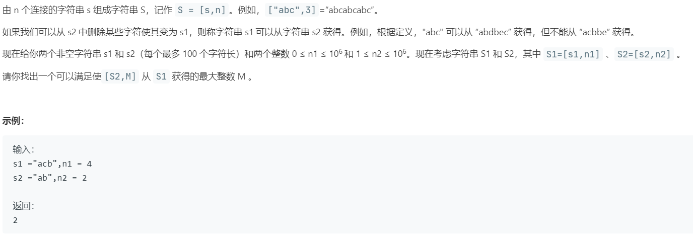

# *466.统计重复个数 (Hard)

## 题目描述



### 标签

动态规划；

## 思路 & 代码

> 又是 dp，又是 dp，又是 dp，昨天力扣杯和双周赛，今天周赛，都有 dp，都是一瞅就 dp，一写就完犊子，带废物，cyka blyat!

这题目描述感觉说的都不是人话。。。总之就是俩字符串 S1 = s1 * n1, S2 = s2 * n2 要找出 S2 * M，可从 S1 获得（删除某些字符）的最大 M。

那就是我们要找到 S2 在 S1 中的循环部分。这我也没看出来能用 dp 啊，而且感觉不知道怎么实现。。。

参考[一位带哥的题解](https://blog.by24.cn/archives/leetcode-count-the-repetitions.html)

思路就是找循环节，遍历到第一次出现循环的时候，计算有多少循环，直接跳到最后。

下面看一下一位带哥的 dp 题解：

- dp[i][0]：s2的第i个字符开始与s1的第1个字符比较，记录单次在s1的长度比较下，s2完结比较的次数。
- dp[i][1]：s2的第i个字符开始与s1的第1个字符比较，记录单次在s1的长度比较下，下一轮开始比较的s2的字符位置。

说实话我没看懂这是啥玩意。

```c++ tab="循环节"
class Solution {
public:
    int getMaxRepetitions(string s1, int n1, string s2, int n2) {
        int len1 = s1.length();
        int len2 = s2.length();
        if(len1 == 0 || len2 == 0 || len1 * n1 < len2 * n2) {
            return 0;
        }
        int idx1 = 0, idx2 = 0;
        unordered_map<int, int> map1, map2;
        int res = 0;
        while(idx1 / len1 < n1) {
            if(idx1 % len1 == len1 - 1) {
                if(map1.count(idx2 % len2)) {
                    int val = map1[idx2 % len2];
                    int cycleLen = idx1 / len1 - val / len1;
                    int cycleNum = (n1 - 1 - idx1 / len1) / cycleLen;
                    int cycleS2Num = idx2 / len2 - map2[idx2 % len2] / len2;

                    idx1 += cycleNum * cycleLen * len1;
                    res += cycleNum * cycleS2Num;
                }else {
                    map1[idx2 % len2] = idx1;
                    map2[idx2 % len2] = idx2;
                }
            }
            if(s1[idx1 % len1] == s2[idx2 % len2]) {
                if(idx2 % len2 == len2 - 1) {
                    res += 1;
                }
                idx2++;
            }
            idx1++;
        }
        return res / n2;
    }
};
```

```c++ tab="dp"
class Solution {
public:
    int getMaxRepetitions(string s1, int n1, string s2, int n2) {
        //动态规划，求s2,从第一个开始到第n个开始，分别能走多少圈，结尾是哪个
        int result = 0;

        if(n1 == 0 || n2 == 0){
            return result;
        }
        int s1Length = s1.size();
        int s2Length = s2.size();

        int dp[s2Length][2];//第i个字符开始和s1匹配，是s2能在单次s1的长度中出现的次数，以及下一次匹配s2开始的字符
        int begin,tmpResult;
        //计算dp的值
        for(int i = 0 ; i < s2Length; i++){
            begin = i,tmpResult = 0;
            for(int j = 0 ; j < s1Length; j++){
                if(s1[j] == s2[begin]){
                    begin++;
                }
                if(begin == s2Length){
                    begin = 0;
                    tmpResult++;
                }
            }
            dp[i][0] = tmpResult;
            dp[i][1] = begin;
        }

        result = 0;
        begin = 0;
        //计算s2出现的总次数
        for(int i = 0 ; i < n1; i++){
            result += dp[begin][0];
            begin = dp[begin][1];
        }
        result = result/n2;
        return result;
    }
};
```