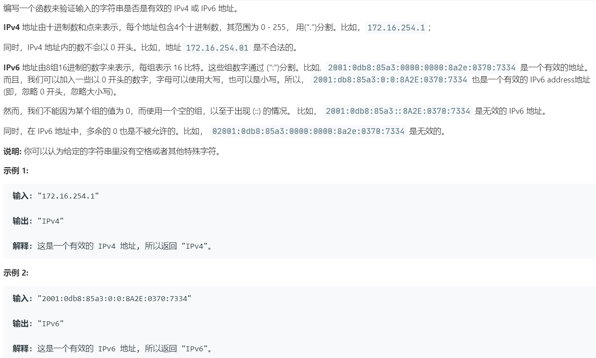

# 468.验证 IP 地址 (Medium)

## 题目描述



## 思路 & 代码

ipv4 的规则很简单，v6 的地址这里为了简单禁止了 `::` 的格式。先实现一个 split 函数，根据 `.` 和 `:` 对字符串分割后判断。

```c++
class Solution {
public:
    string validIPAddress(string IP) {
        if(isValidIPv4(IP)) {
            return "IPv4";
        }else if(isValidIPv6(IP)) {
            return "IPv6";
        }
        return "Neither";
    }
    vector<string> split(const string& s, const char delim = ' ') {
        string tmp;
        stringstream ss(s);
        vector<string> res;
        while(getline(ss, tmp, delim)) {
            res.push_back(tmp);
        }
        if(!s.empty() && s.back() == delim) {
            res.push_back("");
        }
        return res;
    }
    bool isValidIPv4(string ip) {
        auto splited = split(ip, '.');
        if(splited.size() != 4) {
            return false;
        }
        for(auto& s : splited) {
            if(s == "" || s.length() > 1 && s[0] == '0' || s.length() > 3) {
                return false;
            }
            for(auto& c : s) {
                if(c > '9' || c < '0') {
                    return false;
                }
            }
            int num = stoi(s);
            if(num < 0 || num > 255) {
                return false;
            }
        }
        return true;
    }
    bool isValidIPv6(string ip) {
        auto splited = split(ip, ':');
        if(splited.size() != 8) {
            return false;
        }
        for(auto& s : splited) {
            if(s == "" || s.size() > 4) {
                return false;
            }
            for(auto& c : s) {
                if(!(c >= '0' && c <= '9' || c >= 'a' && c <= 'f' || c >= 'A' && c <= 'F')) {
                    return false;
                }
            }
        }
        return true;
    }
};
```