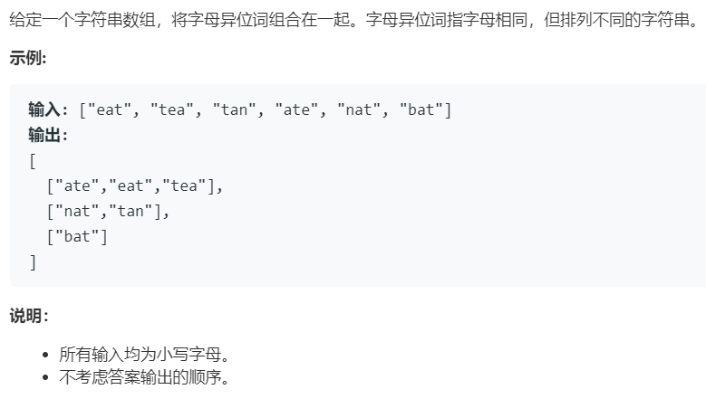

# 49.字母异位词分组 (Medium)

## 题目描述



### 标签

哈希表；字符串；

## 思路 & 代码

异位字符串排序后相等，可以维护一个列表。或者统计词频后序列化，感觉想不太出来别的方法了。

```c++
class Solution {
public:
    vector<vector<string>> groupAnagrams(vector<string>& strs) {
        vector<vector<string>> res;
        unordered_map<string, vector<string>> strMap;
        string tmp;
        for(auto& s : strs) {
            tmp = s;
            sort(tmp.begin(), tmp.end());
            strMap[tmp].push_back(s);
        }
        for(auto& i : strMap) {
            res.push_back(i.second);
        }
        return res;
    }
};
```