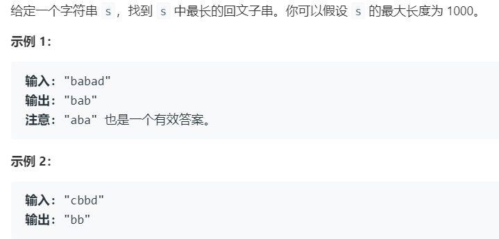

# 5.最长回文子串 (Medium)

## 题目描述



### 标签

字符串；动态规划；

## 思路 & 代码

最简单的就是暴力枚举所有字符串，判断是否是回文，是则更新长度，时间复杂度 $O(n^3)$，枚举平方加上线性判断回文。太慢了 8。

可以把字符串反转然后求公共子串，同时判断下标位置关系确定是不是回文串。最长公共子串长度，一瞅就是 dp。dp[i][j] 表示字符串 i 和 j 的最长公共子串长度。

还有一种 dp，dp[i][j] 表示 i 到 j 之间的子串是否是回文子串，则有 dp[i][j] = (s[i] == s[j] && dp[i + 1][j - 1])，需要注意的是要保证 i + 1 <= j - 1，枚举子串长度和起始位置即可。时间复杂度 $O(n^2)$。还可以倒着遍历 i。还可以优化空间，求第 i 行只需要 i + 1，j 只需要 j - 1，为了使用上一层的 j - 1，j 也要倒着遍历。

中心扩展法，回文串肯定是对称的，所以每次选一个中心往左右扩展，中心可以是一个或两个字符，因此一共有 n + n - 1 个中心。时间复杂度 $O(n^2)$。

再就是 Manacher 算法，专门用来查找字符串最长回文子串的线性算法。首先通过在相邻字符间插入 \#，然后在首尾添加 ^ 和 \$，处理后的字符串长度恒为奇数 (n + n + 1)。用数组 p 保存从中心扩展的最大个数，也是源字符串的总长度。如对于处理过后的字符串 "^#c#b#c#b#c#$"，p[6] = 5，表示从左边扩展 5 个字符，同时恢复到原字符串 "cbcbc" 的长度也为 5。由此对于中心 p[i] 处的字符串，原字符串起始位置为 (i - p[i]) / 2。

求 p[i] 的过程充分利用了回文串的对称性，以 c 为回文串中心，r 表示回文半径即 r = c + p[c]，求 p[i]，

```c++ tab="反转后公共子串"
class Solution {
public:
    string longestPalindrome(string s) {
        int len = s.length();
        if(len == 0) {
            return "";
        }
        vector<vector<int>> dp(len, vector<int>(len, 0));
        auto origin = s;
        reverse(s.begin(), s.end());
        int res = 0;
        int end = 0;
        for(int i = 0; i < len; i++) {
            for(int j = 0; j < len; j++) {
                if(origin[i] == s[j]) {
                    if(i == 0 || j == 0) {
                        dp[i][j] = 1;
                    }else {
                        dp[i][j] = dp[i - 1][j - 1] + 1;
                    }
                }
                // 满足条件还要判断下标是否符合条件，如 abc123cba。
                if(dp[i][j] > res && len - 1 - j + dp[i][j] - 1 == i) {
                    res = dp[i][j];
                    end = i;
                }
            }
        }
        return origin.substr(end - res + 1, res);
    }
};
```

```c++ tab="dp 枚举长度"
class Solution {
public:
    string longestPalindrome(string s) {
        int len = s.length();
        vector<vector<bool>> dp(len, vector<bool>(len, false));
        string res = "";
        int maxLen = 0;
        for(int i = 1; i <= len; i++) {
            for(int start = 0; start < len; start++) {
                int end = start + i - 1;
                if(end >= len) {
                    break;
                }
                // 对于长度为 1 和 2 的直接初始化。
                dp[start][end] = ((i == 1 || i == 2 || dp[start + 1][end - 1]) && s[start] == s[end]);
                if(dp[start][end] && i > maxLen) {
                    maxLen = i;
                    res = s.substr(start, i);
                }
            }
        }
        return res;
    }
};
```

```c++ tab="dp 倒着遍历"
class Solution {
public:
    string longestPalindrome(string s) {
        int len = s.length();
        vector<vector<bool>> dp(len, vector<bool>(len, false));
        string res = "";
        int maxLen = 0;
        for(int i = len - 1; i >= 0; i--) {
            for(int j = i; j < len; j++) {
                dp[i][j] = (s[i] == s[j] && (j - i < 2 || dp[i + 1][j - 1]));
                if(dp[i][j] && j - i + 1 > maxLen) {
                    maxLen = j - i + 1;
                    res = s.substr(i, maxLen);
                }
            }
        }
        return res;
    }
};
```

```c++ tab="dp 优化空间"
class Solution {
public:
    string longestPalindrome(string s) {
        int len = s.length();
        vector<bool> dp(len, false);
        string res = "";
        int maxLen = 0;
        for(int i = len - 1; i >= 0; i--) {
            for(int j = len - 1; j >= i; j--) {
                dp[j] = (s[i] == s[j] && (j - i < 3 || dp[j - 1]));
                if(dp[j] && j - i + 1 > maxLen) {
                    maxLen = j - i + 1;
                    res = s.substr(i, maxLen);
                }
            }
        }
        return res;
    }
};
```

```c++ tab="中心扩展"
class Solution {
private:
    int expandAroundCenter(string &s, int l, int r) {
        int len = s.length();
        while(l >= 0 && r < len && s[l] == s[r]) {
            l--;
            r++;
        }
        return r - l - 1;
    }
public:
    string longestPalindrome(string s) {
        int len = s.length();
        if(len == 0) {
            return "";
        }
        int maxLen = 0;
        int res = 0;
        for(int i = 0; i < len; i++) {
            int len1 = expandAroundCenter(s, i, i);
            int len2 = expandAroundCenter(s, i, i + 1);
            int cur = max(len1, len2);
            if(cur > maxLen) {
                maxLen = cur;
                res = i - (cur - 1) / 2;
            }
        }
        return s.substr(res, maxLen);
    }
};
```