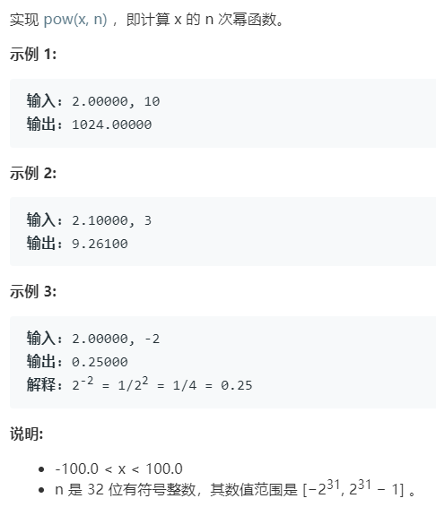

# 50.Pow(x, n) (Medium)

## 题目描述



## 思路 & 代码

快速幂

```c++
class Solution {
private:
    bool isEqual(double a, double b) {
        return a - b > -1e-6 && a - b < 1e-6;
    }
    inline double fastPow(double x, int n) {
        double res = 1.0;
        while(n) {
            if(n & 1) {
                res *= x;
            }
            x *= x;
            n >>= 1;
        }
        return res;
    }
public:
    double myPow(double x, int n) {
        // 底数是 0
        if(isEqual(x, 0.0)) {
            return 0.0;
        }
        if(isEqual(x, 1.0)) {
            return 1.0;
        }
        if(isEqual(x, -1.0)) {
            return n & 1 ? -1.0 : 1.0;
        }
        if(n == (signed int) 0x80000000) {
            return 0.0;
        }
        int sign = n < 0 ? -1 : 1;
        n *= sign;
        double res = fastPow(x, n);
        if(sign == -1) {
            res = 1.0 / res;
        }
        return res;
    }
};
```