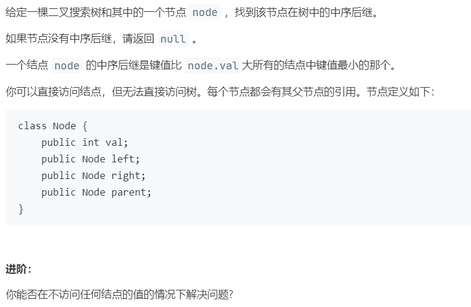

# 510.二叉搜索树中的中序后继 II (Medium)

## 题目描述



## 思路 & 代码

结点带指向父节点的指针就简单多了，右结点为空则向上找到第一个以此子树为左子树的结点，右结点非空向下找到右子树的最左结点。

```c++
class Solution {
public:
    Node* inorderSuccessor(Node* node) {
        if(node == nullptr) {
            return nullptr;
        }
        // 右子树为空则结果为以此子树为左子树的第一个结点
        if(node->right == nullptr) {
            while(node->parent != nullptr) {
                auto root = node->parent;
                if(root->left == node) {
                    return root;
                }
                node = root;
            }
        }else {
            auto p = node->right;
            while(p->left != nullptr) {
                p = p->left;
            }
            return p;
        }
        return nullptr;
    }
};
```