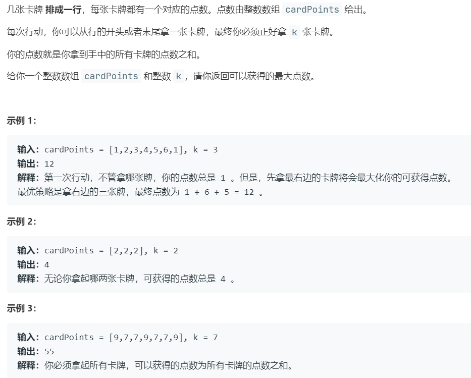
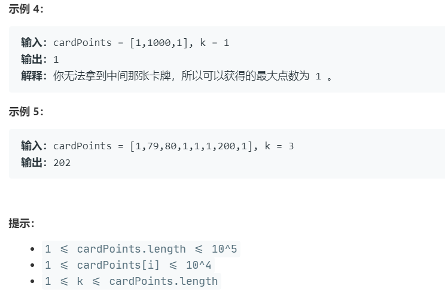

# 5393.可获得的最大点数 (Medium)

## 题目描述





### 标签

动态规划；滑动窗口；

## 思路 & 代码

这个题跟石子游戏那个题差不多，可惜那个题当时就直接投机取巧 return true 了。。。

不过这个题其实也不用非得 dp，周赛的时候写了一个递归的结果疯狂超时，思维被限制住了。仔细想一下，先全取最左边的 k 个，然后一个个换最后取最大值就完事了。

```c++ tab="前缀和"
class Solution {
public:
    int maxScore(vector<int>& nums, int k) {
        int res = 0;
        int sum = 0;
        for(int i = 0; i < k; i++) {
            sum += nums[i];
        }
        int n = nums.size();
        res = sum;
        for(int i = 0; i < k; i++) {
            // 注意这里每次减去的是左侧取得值中最右侧的
            sum = sum - nums[k - i - 1] + nums[n - 1 - i];
            res = max(res, sum);
        }
        return res;
    }
};
```
