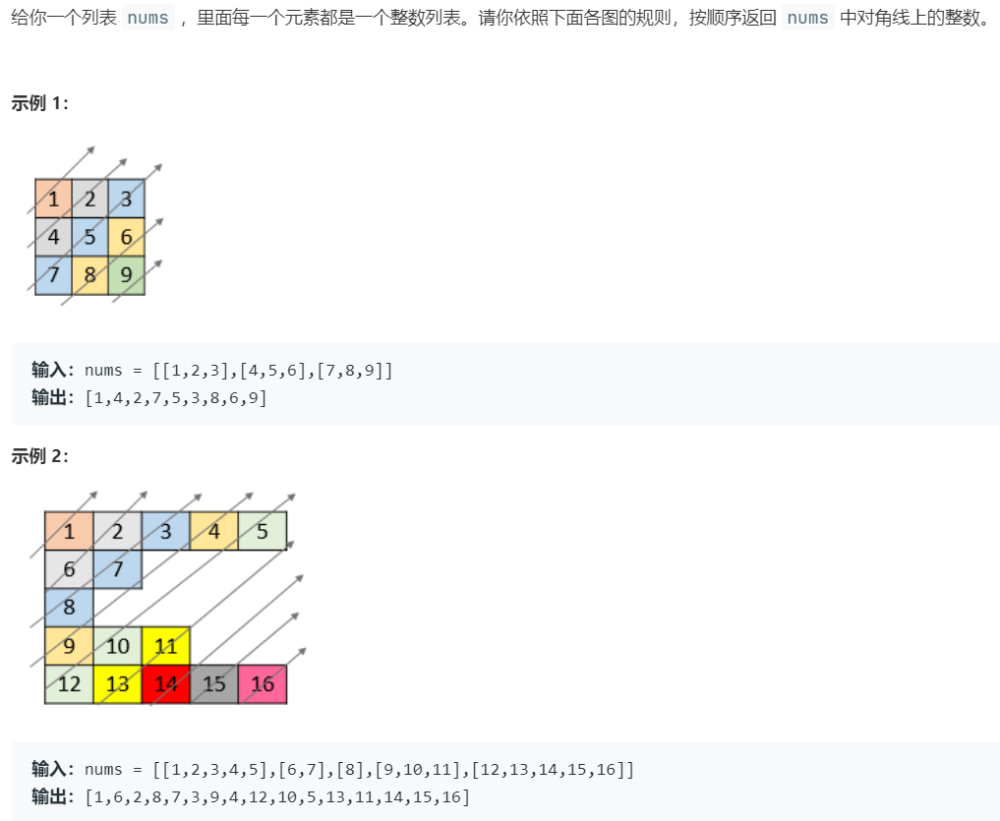
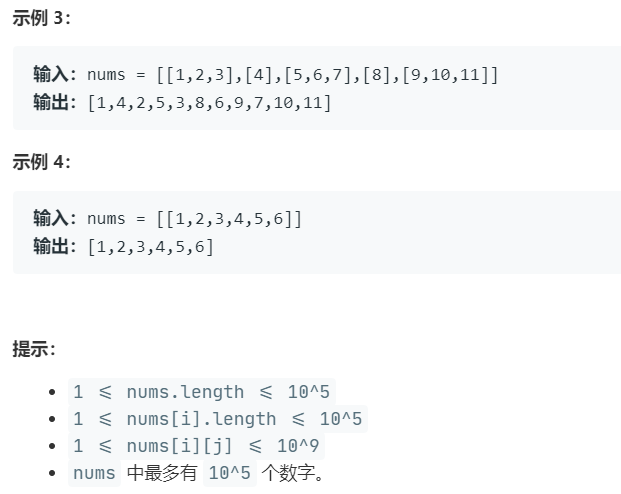

# 5394.对角线遍历 II (Medium)

## 题目描述





## 思路 & 代码

主要问题在于输入并不是矩阵，而是长短不一的，需要注意遍历的边界问题。对角线的话就是以 i + j 遍历。

tmlgb 我时间复杂度也是 n * 2 就不懂为啥会超时。。。

```c++ tab="瞎jb遍历"
class Solution {
public:
    vector<int> findDiagonalOrder(vector<vector<int>>& nums) {
        map<int, vector<int>> mp;
        for(int i = nums.size() - 1; i >= 0; i--) {
            for(int j = 0, n = nums[i].size(); j < n; j++) {
                mp[i + j].push_back(nums[i][j]);
            }
        }
        vector<int> res;
        for(auto& m : mp) {
            for(auto& i : m.second) {
                res.push_back(i);
            }
        }
        return res;
    }
};
```