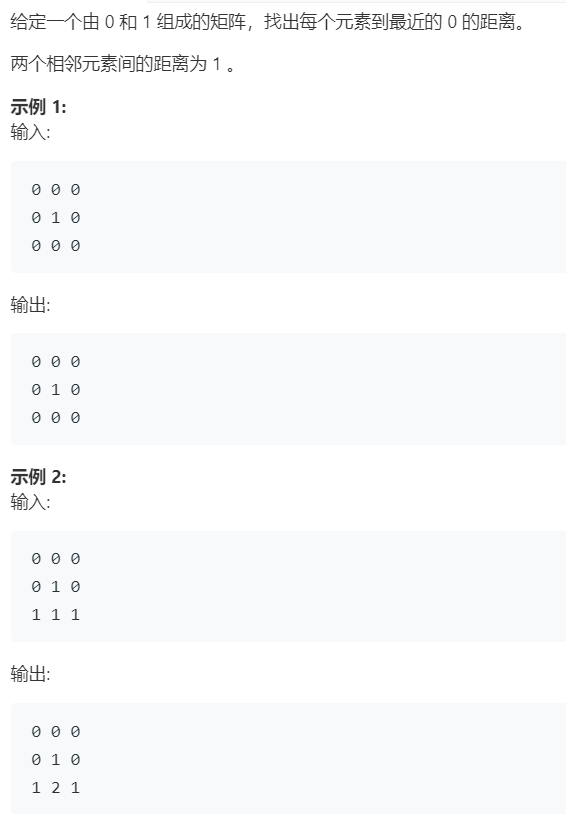

# 542.01 矩阵 (Medium)

## 题目描述



### 标签

深度优先搜索；广度优先搜索；

## 思路 & 代码

这种找最近距离的用 bfs 就行了。最好想的就是从所有的 1 开始遍历，优化的就是可以从 0 开始遍历，这样只要先把所有 0 入队统一处理。

看题解还可以用 dp，扫描两遍。dp[i][j] 表示点到 0 的最短距离，dp[i][j] 为 0 或者相邻的 dp + 1，两个方向更新两次即可。

```c++ tab="从 1 bfs"
class Solution {
private:
    int bfs(vector<vector<int>>& matrix, int i, int j) {
        int m = matrix.size();
        int n = matrix[0].size();
        queue<pair<int, int>> q;
        q.push({i, j});
        int cnt = -1;
        while(!q.empty()) {
            int len = q.size();
            cnt++;
            while(len--) {
                auto x = q.front().first, y = q.front().second;
                q.pop();
                if(x >= 0 && x < m && y >= 0 && y < n && matrix[x][y] == 0) {
                    return cnt;
                }
                q.push({x + 1, y});
                q.push({x - 1, y});
                q.push({x, y + 1});
                q.push({x, y - 1});
            }
        }
        return 0;
    }
public:
    vector<vector<int>> updateMatrix(vector<vector<int>>& matrix) {
        int m = matrix.size();
        int n = matrix[0].size();
        for(int i = 0; i < m; i++) {
            for(int j = 0; j < n; j++) {
                if(matrix[i][j]) {
                    matrix[i][j] = bfs(matrix, i, j);
                }
            }
        }
        return matrix;
    }
};
```

```c++ tab="从 0 bfs"
class Solution {
public:
    vector<vector<int>> updateMatrix(vector<vector<int>>& matrix) {
        int m = matrix.size();
        int n = matrix[0].size();
        queue<pair<int, int>> q;
        vector<pair<int, int>> around = {{0, 1}, {0, -1}, {1, 0}, {-1, 0}};
        for(int i = 0; i < m; i++) {
            for(int j = 0; j < n; j++) {
                if(matrix[i][j]) {
                    matrix[i][j] = INT_MAX;
                }else {
                    q.push({i, j});
                }
            }
        }
        while(!q.empty()) {
            auto cur = q.front();
            q.pop();
            for(int i = 0; i < 4; i++) {
                int x = cur.first + around[i].first;
                int y = cur.second + around[i].second;
                if(x >= 0 && x < m && y >= 0 && y < n && matrix[cur.first][cur.second] + 1 < matrix[x][y]) {
                    matrix[x][y] = matrix[cur.first][cur.second] + 1;
                    q.push({x, y});
                }
            }
        }
        return matrix;
    }
};
```

```c++ tab="dp"
class Solution {
public:
    vector<vector<int>> updateMatrix(vector<vector<int>>& matrix) {
        int m = matrix.size();
        int n = matrix[0].size();
        vector<vector<int>> dp(m, vector<int>(n, 0));
        for(int i = 0; i < m; i++) {
            for(int j = 0; j < n; j++) {
                if(matrix[i][j] == 0) {
                    continue;
                }
                int l = (i == 0 ? 10001 : dp[i - 1][j] + 1);
                int u = (j == 0 ? 10001 : dp[i][j - 1] + 1);
                dp[i][j] = min(l, u);
            }
        }
        for(int i = m - 1; i >= 0; i--) {
            for(int j = n - 1; j >= 0; j--) {
                if(matrix[i][j] == 0) {
                    continue;
                }
                int r = (i == m - 1 ? 10001 : dp[i + 1][j] + 1);
                int d = (j == n - 1 ? 10001 : dp[i][j + 1] + 1);
                dp[i][j] = min(dp[i][j], min(r, d));
            }
        }
        return dp;
    }
};
```