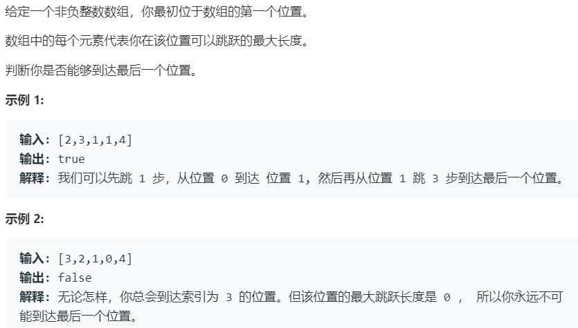

# 55.跳跃游戏 (Medium)

## 题目描述



### 标签

贪心算法；

## 思路 & 代码

一顿跳就完事了，注意 nums[i] 表示的是在当前位置的最大跳跃长度。

```c++
class Solution {
public:
    bool canJump(vector<int>& nums) {
        int res = 0;
        for(int i = 0, len = nums.size(); i < len; i++) {
            if(i > res) {
                return false;
            }
            res = max(res, i + nums[i]);
        }
        return true;
    }
};
```