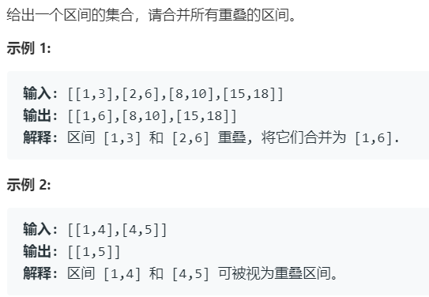

# *56.合并区间 (Medium)

## 题目描述



### 标签

排序；双指针；

## 思路 & 代码

先根据区间左界排序，然后双指针合并重叠。

```c++ tab="排序后双指针"
class Solution {
public:
    vector<vector<int>> merge(vector<vector<int>>& inter) {
        int len = inter.size();
        if(len <= 1) {
            return inter;
        }
        sort(inter.begin(), inter.end(), [&](vector<int>& a, vector<int>& b) -> int {
            return a[0] < b[0];
        }); 
        vector<vector<int>> res;
        int l = 0, r = 0;
        while(r < len) {
            if(inter[r][0] > inter[l][1]) {
                res.push_back(inter[l]);
                l = r;
            }else if(inter[r][1] <= inter[l][1]) {
                r++;
            }else {
                inter[l][1] = inter[r][1];
                r++;
            }
        }
        res.push_back(inter[l]);
        return res;
    }
};
```