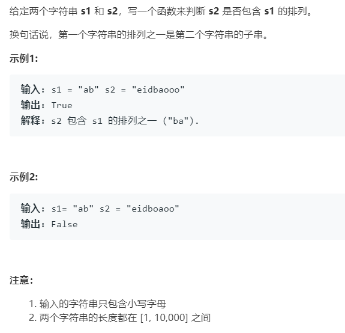

# 567.字符串的排列 (Medium)

## 题目描述



### 标签

滑动窗口；

## 思路 & 代码

滑动窗口的基本框架：

```c++
int left = 0, right = 0;

while (right < s.size()) {`
    window.add(s[right]);
    right++;

    while (window needs shrink) {
        window.remove(s[left]);
        left++;
    }
}
```

先扩充窗口直到满足条件，再在满足条件的基础上缩减窗口。滑动窗口要考虑的细节问题：

1. r++ 时需要更新哪些数据；
2. 什么时候开始缩小窗口；
3. l++ 时更新哪些数据；
4. 什么时候更新结果。

这个题的主要问题是怎么判断满足条件，这里使用 valid 统计符合条件的字符数。

```c++ tab="滑动窗口"
class Solution {
public:
    bool checkInclusion(string t, string s) {
        int len = s.length();
        int tar = t.length();
        unordered_map<char, int> need, window;
        for(auto& c : t) {
            need[c]++;
        }
        int l = 0, r = 0;
        int valid = 0;
        while(r < len) {
            auto c = s[r];
            r++;
            if(need.count(c)) {
                window[c]++;
                if(window[c] == need[c]) {
                    valid++;
                }
            }
            
            while(r - l >= tar) {
                if(valid == need.size()) {
                    return true;
                }
                auto del = s[l];
                l++;
                if(need.count(del)) {
                    if(window[del] == need[del]) {
                        valid--;
                    }
                    window[del]--;
                }
            }
        }
        return false;
    }
};
```