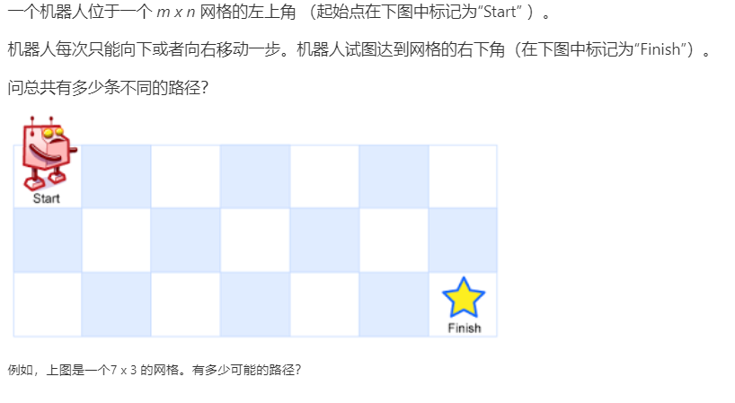
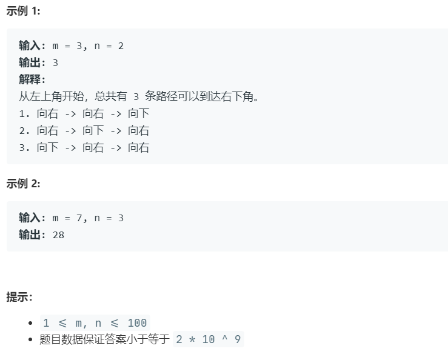

# 62.不同路径 (Medium)

## 题目描述





### 标签

动态规划；

## 思路 & 代码

> 一瞅就 dp，一写还真会！！！ 泪目

dp[i][j] 表示当前格的路径总数，状态方程 dp[i][j] = dp[i - 1][j] + dp[i][j - 1]，可以压缩成一维 dp[j] += dp[j - 1]。

```c++ tab="dp"
class Solution {
public:
    int uniquePaths(int m, int n) {
        vector<int> dp(n, 1);
        for(int i = 1; i < m; i++) {
            for(int j = 1; j < n; j++) {
                dp[j] += dp[j - 1];
            }
        }
        return dp[n - 1];
    }
};
```