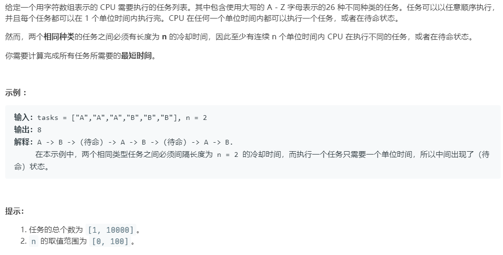

# 621.任务调度器 (Medium)

## 题目描述



### 标签

贪心算法；队列；

## 思路 & 代码

相同任务间有冷却时间，所以尽可能把不同的任务放到间隙中。可以看成 n + 1 容量的桶，每个桶内不能放相同的任务，看最多需要几个桶。最后的时间就是 (cnt - 1) * (n + 1) + last。而 last 部分计算次数同为最大的任务个数即可。

```c++
class Solution {
public:
    int leastInterval(vector<char>& tasks, int n) {
        vector<int> cnt(26, 0);
        for(auto& c : tasks) {
            cnt[c - 'A']++;
        }
        int maxCnt = 0, equalCnt = -1;
        for(auto& i : cnt) {
            maxCnt = max(i, maxCnt);
        }
        for(auto& i : cnt) {
            if(i == maxCnt) {
                equalCnt++;
            }
        }
        return max((maxCnt - 1) * n + maxCnt + equalCnt, static_cast<int>(tasks.size()));
    }
};

```