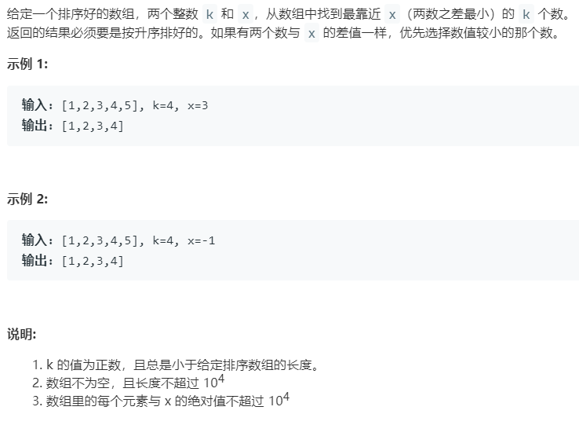

# 658.找到 K 个最接近的元素 (Medium)

## 题目描述



### 标签

二分查找；

## 思路 & 代码

最简单的办法肯定是求差然后排序，时间复杂度 $O(n\log n)$。不过给出的数组是有序的，所以可以利用这一性质，如果 x 小于首元素或大于尾元素，那么结果就是数组的前或后 k 个元素。其他情况这 k 个元素肯定是连续相邻的元素，所以我们只要检索边界值。

```c++ tab="二分查找"
class Solution {
public:
    vector<int> findClosestElements(vector<int>& nums, int k, int x) {
        int l = 0, r = nums.size() - k;
        while(l < r) {
            int mid = l + (r - l) / 2;
            if(x - nums[mid] > nums[mid + k] - x) {
                l = mid + 1;
            }else {
                r = mid;
            }
        }
        return vector<int>(nums.begin() + l, nums.begin() + l + k);
    }
};
```