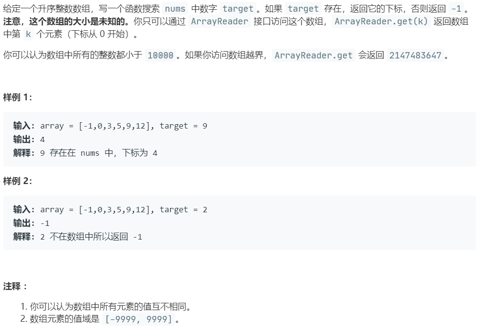

# 702.搜索长度未知的有序数组 (Medium)

## 题目描述



### 标签

二分查找；

## 思路 & 代码

长度未知，访问超长返回 INT_MAX。我们不用在开始就确定二分的右边界，开始就 l = 0, r = 1，没找到就向右扩展，l = r, r += r。

```c++
/**
 * // This is the ArrayReader's API interface.
 * // You should not implement it, or speculate about its implementation
 * class ArrayReader {
 *   public:
 *     int get(int index);
 * };
 */

class Solution {
public:
    int search(const ArrayReader& reader, int target) {
        if(reader.get(0) == target) {
            return 0;
        } 
        int l = 0, r = 1;
        while(reader.get(r) < target) {
            l = r;
            r <<= 1;
        }
        while(l <= r) {
            int mid = l + (r - l) / 2;
            int cur = reader.get(mid);
            if(cur == target) {
                return mid;
            }else if(cur > target) {
                r = mid - 1;
            }else {
                l = mid + 1;
            }
        }
        return -1;
    }
};
```