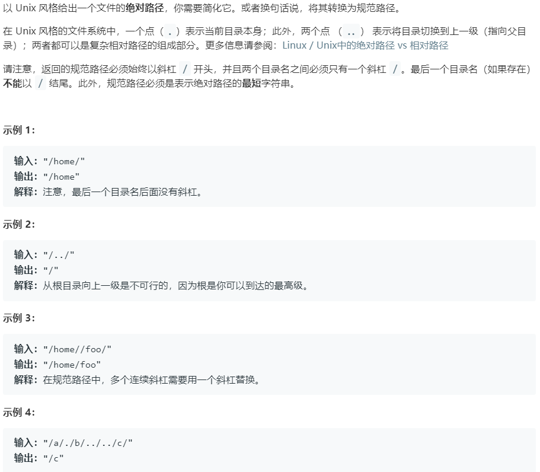

# 71.简化路径 (Medium)

## 题目描述



## 思路 & 代码

主要就是要实现 `..` 的功能，用栈实现。在遇到 `..` 时出栈，否则入栈。

```c++ tab="栈"
class Solution {
public:
    string simplifyPath(string path) {
        path += "/";
        stack<string> st;
        string dir;
        for(auto& c : path) {
            if(c == '/') {
                if(dir == ".." && !st.empty()) {
                    st.pop();
                }else if(dir != ".." && dir != "." && !dir.empty()) {
                    st.push(dir);
                }
                dir.clear();
            }else {
                dir += c;
            }
        }
        string res;
        while(!st.empty()) {
            res = "/" + st.top() + res;
            st.pop();
        }
        if(res.empty()) {
            res = "/";
        }
        return res;
    }
};
```