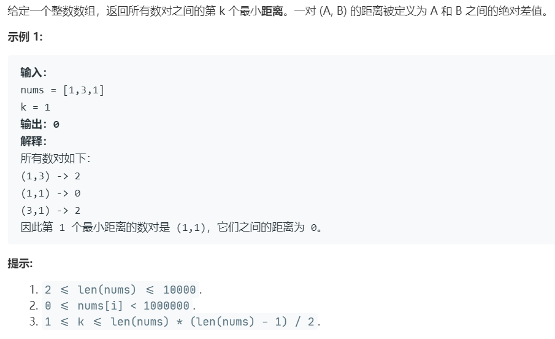

# 719.找出第 k 小的距离对 (Hard)

## 题目描述



### 标签

二分查找；

## 思路 & 代码

对差值二分查找，差值的范围是 0 到 max - min，对于当前的差值 mid，如果差值小于 mid 的数对少于 k 个，那就 l = mid + 1，否则 r = mid。统计的过程可以先排序，然后根据顺序特性优化时间。

```c++ tab="二分"
class Solution {
public:
    int smallestDistancePair(vector<int>& nums, int k) {
        sort(nums.begin(), nums.end());
        int n = nums.size();
        int l = 0, r = nums[n - 1] - nums[0];
        while(l < r) {
            int mid = l + (r - l) / 2;
            int cnt = 0;
            int idx = n - 1;
            for(int i = n - 2; i >= 0; i--) {
                while(idx > i && nums[idx] - nums[i] > mid) {
                    idx--;
                }
                cnt += idx - i;
            }
            
            if(cnt < k) {
                l = mid + 1;
            }else {
                r = mid;
            }
        }
        return l;
    }
};
```