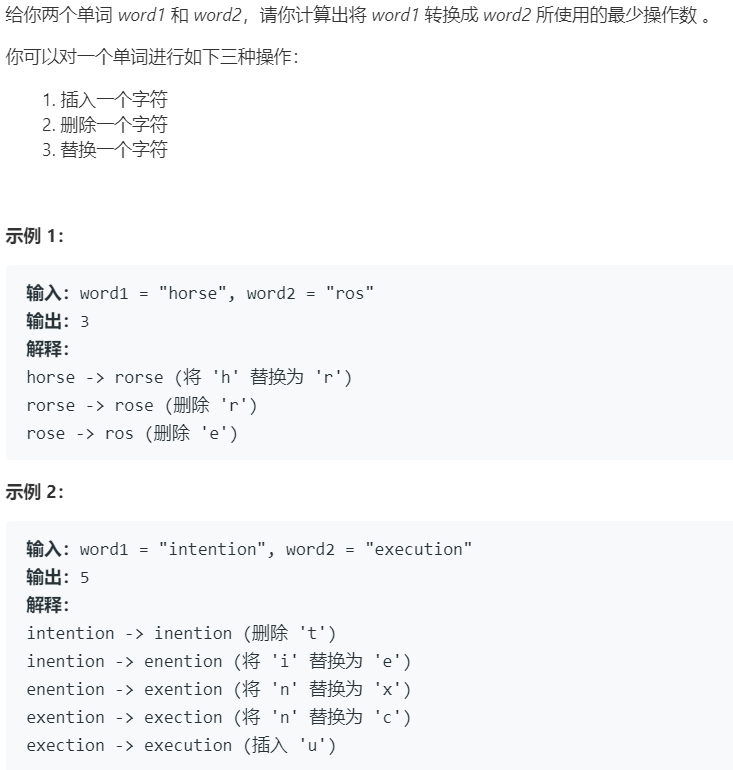

# 72.编辑距离 (Hard)

## 题目描述



### 标签

动态规划；

## 思路 & 代码

> 一瞅就 dp，一写就不会。

dp[i][j] 表示 word1[0, i) 和 word2[0, j) 的最小编辑距离。

状态转移方程：

```c++
if(word1[i] == word2[j]) {
    dp[i][j] = dp[i - 1][j - 1];
}else {
    dp[i][j] = min(dp[i - 1][j - 1], dp[i - 1][j], dp[i][j - 1]) + 1;
}
```

```c++ tab="二维 dp"
class Solution {
public:
    int minDistance(string word1, string word2) {
        int m = word1.length();
        int n = word2.length();
        if(m == 0 || n == 0) {
            return m + n;
        }
        vector<vector<int>> dp(m + 1, vector<int>(n + 1, 0));
        for(int i = 1; i <= m; i++) {
            dp[i][0] = dp[i - 1][0] + 1;
        }
        for(int i = 1; i <= n; i++) {
            dp[0][i] = dp[0][i - 1] + 1;
        }
        for(int i = 1; i <= m; i++) {
            for(int j = 1; j <= n; j++) {
                if(word1[i - 1] == word2[j - 1]) {
                    dp[i][j] = dp[i - 1][j - 1];
                }else {
                    dp[i][j] = min(dp[i - 1][j - 1], min(dp[i - 1][j], dp[i][j - 1])) + 1;
                }
            }
        }
        return dp[m][n];
    }
};
```

```c++ tab="优化空间"
class Solution {
public:
    int minDistance(string word1, string word2) {
        int m = word1.length();
        int n = word2.length();
        if(m == 0 || n == 0) {
            return m + n;
        }
        vector<vector<int>> dp(2, vector<int>(n + 1, 0));
        for(int i = 1; i <= n; i++) {
            dp[0][i] = i;
        }
        for(int i = 1; i <= m; i++) {
            dp[i & 1][0] = dp[(i - 1) & 1][0] + 1;
            for(int j = 1; j <= n; j++) {
                if(word1[i - 1] == word2[j - 1]) {
                    dp[i & 1][j] = dp[(i - 1) & 1][j - 1];
                }else {
                    dp[i & 1][j] = min(dp[(i - 1) & 1][j - 1], min(dp[(i - 1) & 1][j], dp[i & 1][j - 1])) + 1;
                }
            }
        }
        return dp[m & 1][n];
    }
};
```