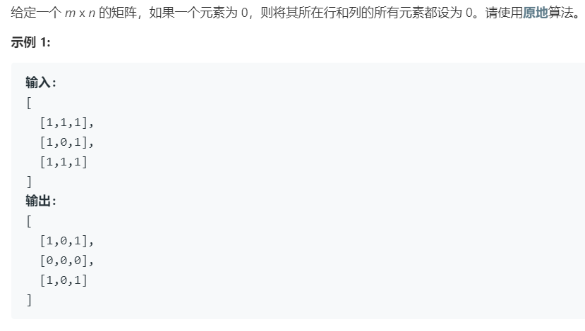

# 73.矩阵置零 (Medium)

## 题目描述



## 思路 & 代码

正常做法就是遍历到 matrix[i][j] = 0 就记录 i, j 然后最后统一置零。要求原地处理，那我们可以对 matrix[i][j] = 0，标记行列头为 0，之后再根据行列头是否为 0 将整行整列置零，同时还要额外判断第 0 行和第 0 列。

```c++
class Solution {
public:
    void setZeroes(vector<vector<int>>& matrix) {
        int m = matrix.size();
        if(m == 0) {
            return;
        }
        int n = matrix[0].size();
        if(n == 0) {
            return;
        }
        bool row0 = false, col0 = false;
        for(int i = 0; i < m; i++) {
            for(int j = 0; j < n; j++) {
                if(matrix[i][j] == 0) {
                    if(i == 0) {
                        row0 = true;
                    }
                    if(j == 0) {
                        col0 = true;
                    }
                    matrix[i][0] = matrix[0][j] = 0;
                }
            }
        }
        for(int i = 1; i < m; i++) {
            for(int j = 1; j < n; j++) {
                if(matrix[0][j] == 0 || matrix[i][0] == 0) {
                    matrix[i][j] = 0;
                }
            }
        }
        if(col0) {
            for(int i = 0; i < m; i++) {
                matrix[i][0] = 0;
            }
        }
        if(row0) {
            for(int i = 0; i < n; i++) {
                matrix[0][i] = 0;
            }
        }
    }
};
```