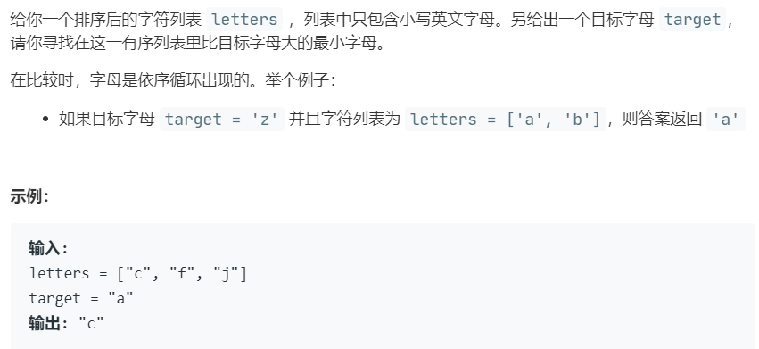

# 744.寻找比目标字母大的最小字母 (Easy)

## 题目描述



### 标签

二分查找；

## 思路 & 代码

查找左边界，主要就是解决字母循环排序的比较问题。开始还在想怎么比较，后来看到题解，搜索不到大的就返回首元素即可。

```c++ tab="二分"
class Solution {
public:
    char nextGreatestLetter(vector<char>& letters, char target) {
        int n = letters.size();
        int l = 0, r = n;
        while(l < r) {
            int mid = l + (r - l) / 2;
            if(target >= letters[mid]) {
                l = mid + 1;
            }else {
                r = mid;
            }
        }
        return letters[l % n];
    }
};
```