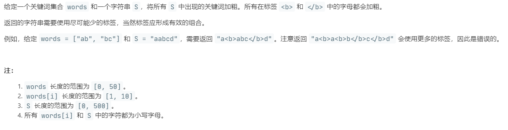

# 758.字符串中的加粗单词 (Medium)

## 题目描述



## 思路 & 代码

将 s 中的所有关键词加粗，标签尽可能少，需要合并。大概思路就是搜索子串找到需要加粗的位置。

还看到有字典树的解法，准备之后学一下。

```c++
class Solution {
public:
    string boldWords(vector<string>& words, string s) {
        int len = s.length();
        vector<bool> flag(len, false);
        for(auto& word : words) {
            int i = 0;
            int curLen = word.length();
            while(i < len) {
                int pos = s.find(word, i);
                if(pos == string::npos) {
                    break;
                }
                for(int j = 0; j < curLen; j++) {
                    flag[j + pos] = true;
                }
                i = pos + 1;
            }
        }
        string res = "";
        if(flag[0]) {
            res = "<b>";
        }
        res += s[0];
        for(int i = 1; i < len; i++) {
            if(flag[i] && !flag[i - 1]) {
                res += "<b>";
            }else if(flag[i - 1] && !flag[i]) {
                res += "</b>";
            }
            res += s[i];
        }
        if(flag[len - 1]) {
            res += "</b>";
        }
        return res;
    }
};
```