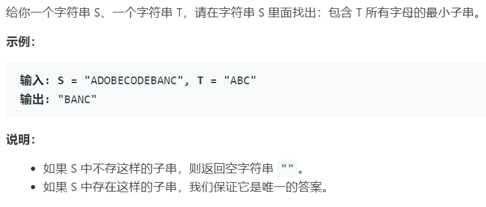

# 76.最小覆盖子串 (Hard)

## 题目描述



### 标签

哈希表；双指针；滑动窗口；

## 思路 & 代码

滑动窗口的一般思路就是先把右侧的加入窗口，然后在保证有效性的情况下删除左侧，缩短窗口。

```c++ tab="滑动窗口框架"
while(r < len) {
    window.add([r++]);
    while(valid) {
        window.remove([l++]);
    }
}
```

对于这个题，就是先把窗口增大到包含所有字母，之后记录长度，缩短窗口，直到窗口不包含所有字母。记录 t 中的字符可以用 vector 替代哈希表。

```c++ tab="滑动窗口"
class Solution {
public:
    string minWindow(string s, string t) {
        vector<int> charMap(128, 0);
        int slen = s.length(), tlen = t.length();
        if(slen == 0 || tlen == 0) {
            return "";
        }
        for(auto i = 0; i < tlen; i++) {
            charMap[t[i]]++;
        }
        int l = 0, r = 0;
        int resl = 0, resr = -1;
        int res = INT_MAX;
        int cnt = tlen;
        while(r < slen) {
            charMap[s[r]]--;
            // 如果 s[r] 在 t 中
            if(charMap[s[r]] >= 0) {
                cnt--;
            }
            while(cnt == 0) {
                int curLen = r - l + 1;
                if(curLen < res) {
                    res = curLen;
                    resl = l;
                    resr = r;
                }
                charMap[s[l]]++;
                // 
                if(charMap[s[l]] > 0) {
                    cnt++;
                }
                l++;
            }
            r++;
        }
        if(res == INT_MAX) {
            return "";
        }
        return s.substr(resl, res);
    }
};
```