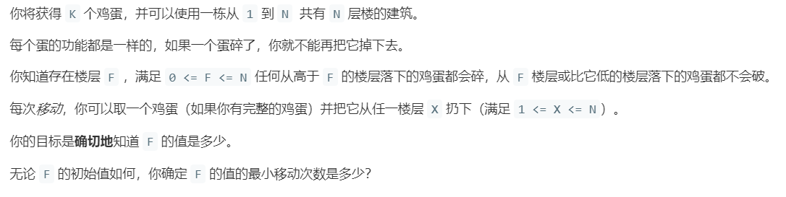

# 887.鸡蛋掉落 (Hard)

## 题目描述



### 标签

动态规划；二分查找；

## 思路 & 代码

> 本题是谷歌用于面试的一道经典面试题之一。由于本题过于经典，谷歌公司已经不再将这题作为面试的候选题目了。(xswl

这个题看似很简单，二分就行了，但是要注意限制了鸡蛋的数量，扔下去碎了就莫得了，没碎还能捡起来再扔。那改进一下，等到只剩一个的时候就一层层的扔线性扫描，但是这样的话多分几块可以减少线性扫描的时间，方法还是不固定。又到了用动态规划的时候了，虽然这题瞅半天也没看出来为啥用 dp。。。

状态就是鸡蛋数 k 和楼层数 n，选择就是去哪层扔鸡蛋。dp[i][j] 表示有 j 个鸡蛋，对于 i 层楼的最小次数。在第 i 层扔鸡蛋就两种情况，碎了就 j - 1，要搜索 i 以下的，没碎就搜索 i+1 ~ n。状态中的 i 应该表示的是范围而不是高度。要注意的是对于每个 dp[i][j] 我们要考虑最坏情况，所以要选取状态转移的较大值。这样 dp 就初步实现了扔鸡蛋问题，时间复杂度 $O(k\cdot n^2)$。

接下来的优化就是对 dp 的优化，使用二分优化 dp 中的循环部分，这并不是说我们是用二分的方法扔鸡蛋，而是对于状态转移方程：

$$
dp[k][n] = \min_{0\leq i \leq n} \{\max\{dp(k - 1, i - 1), dp(k, n - i)\} + 1\}
$$

k 固定，这个值肯定是 n 的单增函数，那么 dp(k - 1, i - 1) 和 dp(k, n - i) 两个值，i 是 1 到 n 递增的，固定的 n 和 k 使得前者随 i 单增，后者随 i 单减。那么我们求二者的较大值，然后再求这些较大值中的最小值，其实就是求两个函数的交点。那么我们可以通过二分查找来找到这个波谷。

```python tab="dp"
def superEggDrop(K: int, N: int) -> int:

    memo = dict()
    def dp(K, N) -> int:
        # base case
        if K == 1: return N
        if N == 0: return 0
        # 避免重复计算
        if (K, N) in memo:
            return memo[(K, N)]

        res = float('INF')
        # 穷举所有可能的选择
        for i in range(1, N + 1):
            res = min(res, 
                      max(
                            dp(K, N - i), 
                            dp(K - 1, i - 1)
                         ) + 1
                  )
        # 记入备忘录
        memo[(K, N)] = res
        return res

    return dp(K, N)
```

```python tab="dp 二分"
def superEggDrop(self, K: int, N: int) -> int:

    memo = dict()
    def dp(K, N):
        if K == 1: return N
        if N == 0: return 0
        if (K, N) in memo:
            return memo[(K, N)]
            
        res = float('INF')
        # 用二分搜索代替线性搜索
        lo, hi = 1, N
        while lo <= hi:
            mid = (lo + hi) // 2
            broken = dp(K - 1, mid - 1) # 碎
            not_broken = dp(K, N - mid) # 没碎
            # res = min(max(碎，没碎) + 1)
            if broken > not_broken:
                hi = mid - 1
                res = min(res, broken + 1)
            else:
                lo = mid + 1
                res = min(res, not_broken + 1)

        memo[(K, N)] = res
        return res

    return dp(K, N)
```