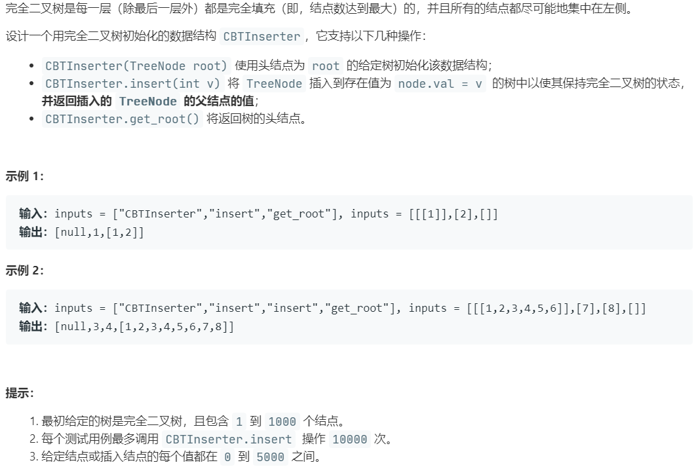

# 919.完全二叉树插入器 (Medium)

## 题目描述



## 思路 & 代码

> u1s1，leetcode 的翻译实属 nt，看中文看了好几遍没看懂。

其实就是完全二叉树插入结点，完全二叉树的话用数组表示就好了，对于下标 i（从 1 开始）的元素，其左右孩子的下标为 2 * i 和 2 * i + 1。可以把所有结点都保存然后插入结点获取头结点就是 i / 2，但这样感觉太占空间了。可以用队列，在初始化的过程中，将根结点的子结点入队，同时将出度为 2 的结点出队，最终队头结点就是要插入结点的子结点。

```c++ tab="队列"
class CBTInserter {
private:
    TreeNode* root;
    queue<TreeNode*> q;
public:
    CBTInserter(TreeNode* _root) {
        root = _root;
        q.push(root);
        while(!q.empty()) {
            auto cur = q.front();
            if(cur->right == nullptr) {
                if(cur->left != nullptr) {
                    q.push(cur->left);
                }
                break;
            }
            q.push(cur->left);
            q.push(cur->right);
            q.pop();
        }
    }
    
    int insert(int v) {
        auto curRoot = q.front();
        auto newNode = new TreeNode(v);
        if(curRoot->left == nullptr) {
            curRoot->left = newNode;
        }else {
            curRoot->right = newNode;
            q.pop();
        }
        q.push(newNode);
        return curRoot->val;
    }
    
    TreeNode* get_root() {
        return root;
    }
};

/**
 * Your CBTInserter object will be instantiated and called as such:
 * CBTInserter* obj = new CBTInserter(root);
 * int param_1 = obj->insert(v);
 * TreeNode* param_2 = obj->get_root();
 */
```