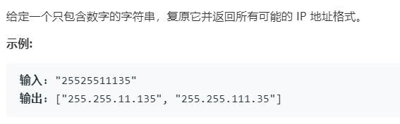

# 93.复原 IP 地址 (Medium)

## 题目描述



### 标签

回溯算法；

## 思路 & 代码

就是把源字符串分成 4 部分，看是否满足 ip 地址格式。回溯或者直接迭代各部分的长度。

```c++ tab="回溯算法"
class Solution {
public:
    vector<string> restoreIpAddresses(string s) {
        int len = s.length();
        vector<string> res;
        backtrack(res, s, 0);
        return res;
    }
    void backtrack(vector<string>& res, string s, int n, string ip = "") {
        if(n == 4) {
            if(s.empty()) {
                res.push_back(ip);
            }
            return;
        }
        for(int i = 1; i < 4; i++) {
            if(s.length() < i) {
                break;
            }
            int val = stoi(s.substr(0, i));
            if(val > 255 || i != to_string(val).length()) {
                continue;
            }
            string next = ip + s.substr(0, i) + (n == 3 ? "" : ".");
            backtrack(res, s.substr(i), n + 1, next);
        }
    }
};
```

```c++ tab="辣鸡 箭头型代码"
class Solution {
public:
    vector<string> restoreIpAddresses(string s) {
        vector<string> res;
        int len = s.length();
        if(len == 0) {
            return res;
        }
        string ip;
        for(int a = 1; a < 4; a++) {
            for(int b = 1; b < 4; b++) {
                for(int c = 1; c < 4; c++) {
                    for(int d = 1; d < 4; d++) {
                        if(a + b + c + d == len) {
                            int ip1 = stoi(s.substr(0, a));
                            int ip2 = stoi(s.substr(a, b));
                            int ip3 = stoi(s.substr(a + b, c));
                            int ip4 = stoi(s.substr(a + b + c));
                            if(ip1 <= 255 && ip2 <= 255 && ip3 <= 255 && ip4 <= 255) {
                                ip = to_string(ip1) + '.' + to_string(ip2) + '.' + to_string(ip3) + '.' + to_string(ip4);
                                if(ip.length() == len + 3) {
                                    res.push_back(ip);
                                }
                            }
                        }
                    }
                }
            }
        }
        return res;
    }
};
```