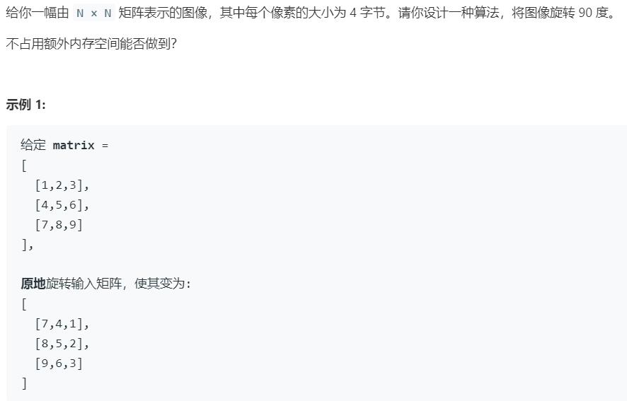

# c0107.旋转矩阵 (Medium)

## 题目描述



## 思路 & 代码

使用辅助空间的话很简单，就是把按行遍历然后按列放置，`newMatrix[j][n - i - 1] = matrix[i][j]`。

设计原地算法就要根据上面的这个公式，旋转的操作可以分解成 `matrix[i][j] => matrix[j][i] => matrix[j][n - i - 1]` 两步。也就是先转置再沿中轴翻转。

翻转实现需要进行两次遍历，有点慢。获取可以直接用一步操作实现，将 `matrix[i][j]` 旋转的值依次为 `matrix[j][n - i - 1] => matrix[n - i - 1][n - j - 1] => matrix[n - j - 1][i] => matrix[i][j]`。因此我们只需要依次把这几个值交换到位就行了。主要的问题遍历的范围，n 是奇或偶的情况不同：

```
n = 2 * k
**--        --**
**--  ==>   --**
----        ----
----        ----
n = 2 * k + 1
***--       ---**
***--       ---**
--^--  ==>  --^**
-----       -----
-----       -----
```

可以看到，偶数就是遍历 [0, n / 2) * [0, n / 2)，奇数就是遍历 [0, n / 2) * [0, (n + 1) / 2)。

```c++ tab="旋转变翻转"
class Solution {
public:
    void rotate(vector<vector<int>>& matrix) {
        int n = matrix.size();
        if(n <= 1) {
            return;
        }
        for(int i = 0; i < n; i++) {
            for(int j = 0; j < i; j++) {
                swap(matrix[i][j], matrix[j][i]);
            }
        }
        for(int i = 0; i < n; i++) {
            for(int j = 0; j < n / 2; j++) {
                swap(matrix[i][j], matrix[i][n - 1 - j]);
            }
        }
    }
};
```

```c++ tab="一步变换"
class Solution {
public:
    void rotate(vector<vector<int>>& matrix) {
        int n = matrix.size();
        if(n <= 1) {
            return;
        }
        for(int i = 0; i < n / 2; i++) {
            for(int j = 0 ; j < (n + 1) / 2; j++) {
                int tmp = matrix[i][j];
                matrix[i][j] = matrix[n - j - 1][i];
                matrix[n - j - 1][i] = matrix[n - i - 1][n - j - 1];
                matrix[n - i - 1][n - j - 1] = matrix[j][n - i - 1];
                matrix[j][n - i - 1] = tmp;
            }
        }
    }
};
```