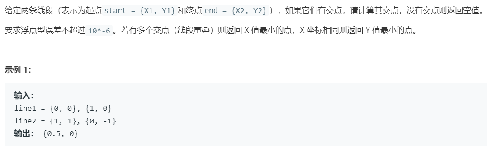

# ci1603.交点 (Hard)

## 题目描述



## 思路 & 代码

> 不知道为啥总整这种数学题，虽然思路不难但是写的时候挺闹挺 ~~cyka blyat~~

比较简单的方法就是求两条直线交点然后判断交点是否在线段范围内。

直线的表示方式有几种：

- 斜截式 $y = kx + b$，常用但是无法表示与 y 轴平行的直线；
- 截距式 $\displaystyle{\frac{x}{a} + \frac{y}{b} = 1}$，可以表示任意直线，但是看起来计算比较麻烦；
- 参数方程 $\left\{\begin{array}{l}x = x_0 + t\Delta x \\ y = y_0 + t\Delta y \end{array}\right.$，可以表示任意的直线，且对于端点为 $(x_1, y_1), (x_2, y_2)$ 的线段，可表示为 $\left\{\begin{array}{l} x=x_{1}+t\left(x_{2}-x_{1}\right) \\ y=y_{1}+t\left(y_{2}-y_{1}\right)\end{array}\right.,t\in [0, 1]$。

使用参数方程解决本题，联立两条线段方程 $\left\{\begin{array}{l} x=x_{1}+t_1\left(x_{2}-x_{1}\right) \\ y=y_{1}+t_1\left(y_{2}-y_{1}\right)\end{array}\right.,t_1\in [0, 1]$ 和 $\left\{\begin{array}{l} x=x_{3}+t_2\left(x_{4}-x_{3}\right) \\ y=y_{3}+t_2\left(y_{4}-y_{3}\right)\end{array}\right.,t_2\in [0, 1]$，对于不平行的两条直线，可解出 $t_1, t_2$，再判断交点是否在线段上即可。

$$
\left\{\begin{array}{l}
t_{1}=\frac{x_{3}\left(y_{4}-y_{3}\right)+y_{1}\left(x_{4}-x_{3}\right)-y_{3}\left(x_{4}-x_{3}\right)-x_{1}\left(y_{4}-y_{3}\right)}{\left(x_{2}-x_{1}\right)\left(y_{4}-y_{3}\right)-\left(x_{4}-x_{3}\right)\left(y_{2}-y_{1}\right)} \\
t_{2}=\frac{x_{1}\left(y_{2}-y_{1}\right)+y_{3}\left(x_{2}-x_{1}\right)-y_{1}\left(x_{2}-x_{1}\right)-x_{3}\left(y_{2}-y_{1}\right)}{\left(x_{4}-x_{3}\right)\left(y_{2}-y_{1}\right)-\left(x_{2}-x_{1}\right)\left(y_{4}-y_{3}\right)}
\end{array}\right.
$$

对于平行的两条线段，通过斜率判断是否平行即可，$\displaystyle{\frac{y_4 - y_3}{x_4 - x_3} = \frac{y_2 - y_1}{x_2 - x_1}}$，为了应对线段平行于 y 轴的情况，用乘法代替除法。平行时还要判断是否在同一直线，可以 1-2 和 1-3 是否平行，如果平行还要判断是否有重叠。

```c++ tab="数学"
class Solution {
public:
    vector<double> intersection(vector<int>& start1, vector<int>& end1, vector<int>& start2, vector<int>& end2) {
        vector<double> res;
        double x1 = start1[0], y1 = start1[1];
        double x2 = end1[0], y2 = end1[1];
        double x3 = start2[0], y3 = start2[1];
        double x4 = end2[0], y4 = end2[1];
        // 判断是否平行
        if((x4 - x3) * (y2 - y1) == (x2 - x1) * (y4 - y3)) {
            // 如果四点共线
            if((y2 - y1) * (x3 - x1) == (x2 - x1) * (y3 - y1)) {
                // 判断 (x, y) 是否在线段 (x1, y1) ~ (x2, y2) 上
                auto inner = [](double x1, double y1, double x2, double y2, double x, double y) -> bool {
                    return (x1 == x2 || x >= min(x1, x2) && x <= max(x1, x2)) && (y1 == y2 || y >= min(y1, y2) && y <= max(y1, y2));
                };
                auto update = [&](double x, double y) {
                    if(res.size() == 0 || x < res[0] || (x == res[0] && y < res[1])) {
                        res = {x, y};
                    }
                };
                // 判断是否重叠
                if(inner(x1, y1, x2, y2, x3, y3)) {
                    update(x3, y3);
                }
                if(inner(x1, y1, x2, y2, x4, y4)) {
                    update(x4, y4);
                }
                if(inner(x3, y3, x4, y4, x1, y1)) {
                    update(x1, y1);
                }
                if(inner(x3, y3, x4, y4, x2, y2)) {
                    update(x2, y2);
                }
            }
        }else {
            auto t1 = ((x3 - x1) * (y4 - y3) + (y1 - y3) * (x4 - x3)) / ((x2 - x1) * (y4 - y3) - (x4 - x3) * (y2 - y1));
            auto t2 = ((x1 - x3) * (y2 - y1) + (y3 - y1) * (x2 - x1)) / ((x4 - x3) * (y2 - y1) - (x2 - x1) * (y4 - y3));
            if(t1 >= 0 && t1 <= 1 && t2 >= 0 && t2 <= 1) {
                res.resize(2);
                res[0] = x1 + t1 * (x2 - x1);
                res[1] = y1 + t1 * (y2 - y1);
            }
        }
        return res;
    }
};
```