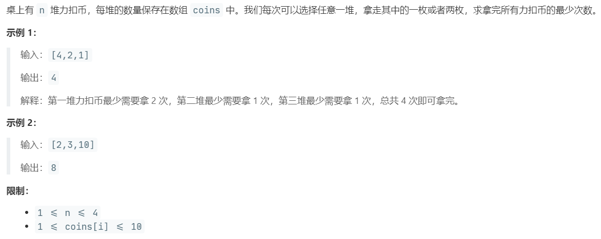

# LCP 06.拿硬币 (Easy)

## 题目描述



## 思路 & 代码

一次拿一个或俩，奇数的进一就行了。

```c++
class Solution {
public:
    int minCount(vector<int>& coins) {
        int len = coins.size();
        if(len == 0) {
            return 0;
        }
        int res = 0;
        for(auto coin : coins) {
            res += (coin + 1) / 2 ;
        }
        return res;
    }
};
```