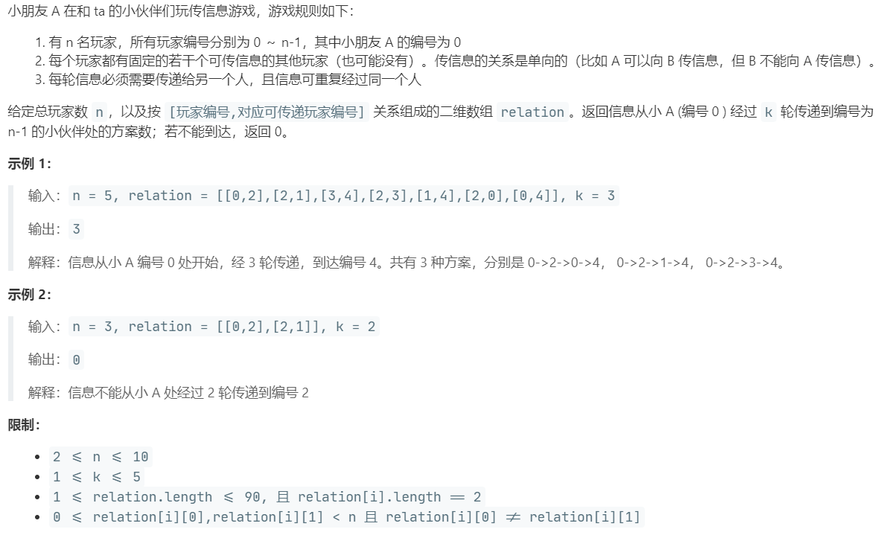

# LCP 07.传递信息 (Easy)

## 题目描述



## 思路 & 代码

~~题干真长~~

可以求邻接矩阵的 k 次方，[i][j] 处的值表示 i 到 j 的路径长度为 k 的路径数。

状态转移，维护 cur 和 next 数组，cur 为当前状态，next 为可达的下一状态，最后看 next 中有几个 n - 1。

或者用 dfs 走 k 步，终点为 n - 1 计数。

咋做都行，习惯用 bfs，走 k 步之后看队列里有几个终点。

```c++
class Solution {
public:
    int numWays(int n, vector<vector<int>>& relation, int k) {
        unordered_map<int, vector<int>> g;
        for(auto r : relation) {
            g[r[0]].push_back(r[1]);
        }
        queue<int> q;
        q.push(0);
        int cnt = 0;
        int res = 0;
        while(!q.empty()) {
            cnt++;
            int len = q.size();
            while(len--) {
                int cur = q.front();
                q.pop();
                auto next = g[cur];
                for(auto i : next) {
                    q.push(i);
                }
            }
            if(cnt == k) {
                break;
            }
        }
        while(!q.empty()) {
            int cur = q.front();
            q.pop();
            if(cur == n - 1) {
                res++;
            }
        }
        return res;
    }
};
```