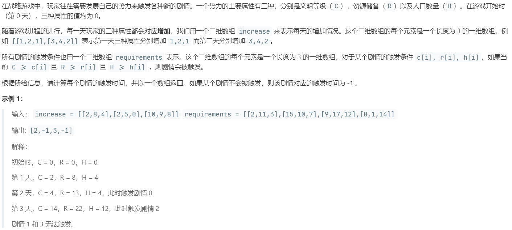

# LCP 08.剧情触发时间 (Medium)

## 题目描述



## 思路 & 代码

比赛的时候一直 TLE，没想出来实属脑瘫。

累加之后二分查找获取左边界就行了，TLE 就是因为一直线性查找。。。

```c++ tab="二分查找"
class Solution {
public:
    vector<int> getTriggerTime(vector<vector<int>>& increase, vector<vector<int>>& requirements) {
        int n = increase.size();
        int len = requirements.size();
        vector<vector<int>> base(n + 1, vector<int>(3, 0));
        base[1] = increase[0];
        for(int i = 2; i <= n; i++) {
            base[i][0] = base[i - 1][0] + increase[i - 1][0];
            base[i][1] = base[i - 1][1] + increase[i - 1][1];
            base[i][2] = base[i - 1][2] + increase[i - 1][2];
        }
        vector<int> res(len, -1);
        for(int i = 0; i < len; i++) {
            auto& req = requirements[i];
            int l = 0, r = n + 1;
            int mid = l + (r - l) / 2;
            while(l < r) {
                mid = l + (r - l) / 2;
                if(base[mid][0] >= req[0] && base[mid][1] >= req[1] && base[mid][2] >= req[2]) {
                    r = mid;
                }else {
                    l = mid + 1;
                }
            }
            if(l == n + 1) {
                res[i] = -1;
            }else {
                res[i] = l;
            }
        }
        return res;
    }
};
```