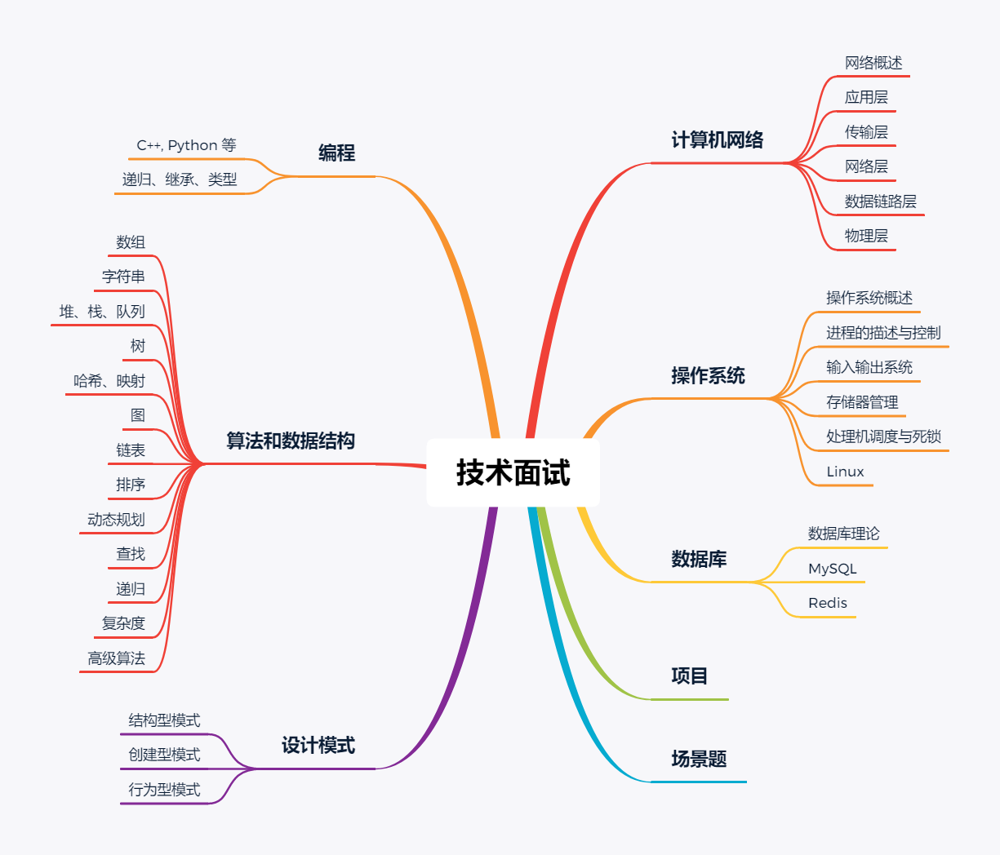
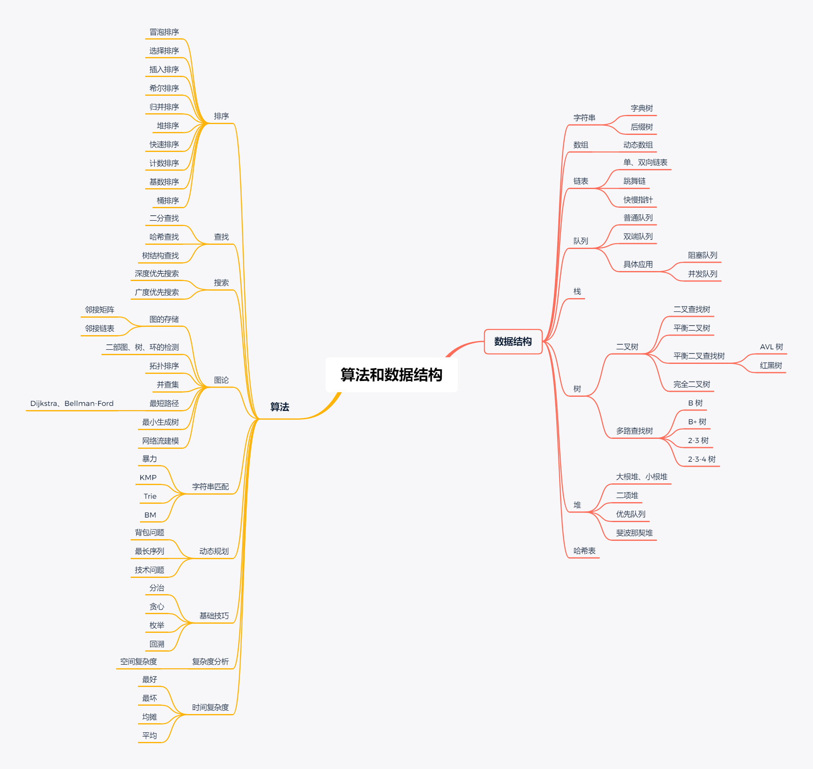

# 菜鸡的 leetcode 记录

记录 leetcode 的刷题学习过程。

> ~~[2020-04-04] 之前为了快速入门都是根据分类刷的，现在准备直接顺序刷~~
> [2020-09-24] 菜鸡又开学了，不找工作，暂时封存

leetcode 上的探索部分还是比较有用的，适合我这种入门的菜鸡。

主要熟悉一下学过的算法以及 C++ STL 的使用。

> - [一位带哥的 CS-Notes](https://cyc2018.github.io/CS-Notes/#/)
> - [另一位带哥的算法小抄](https://labuladong.gitbook.io/algo/)
> - [再一位带哥的 leetcode 题解](https://leetcode.wang)

