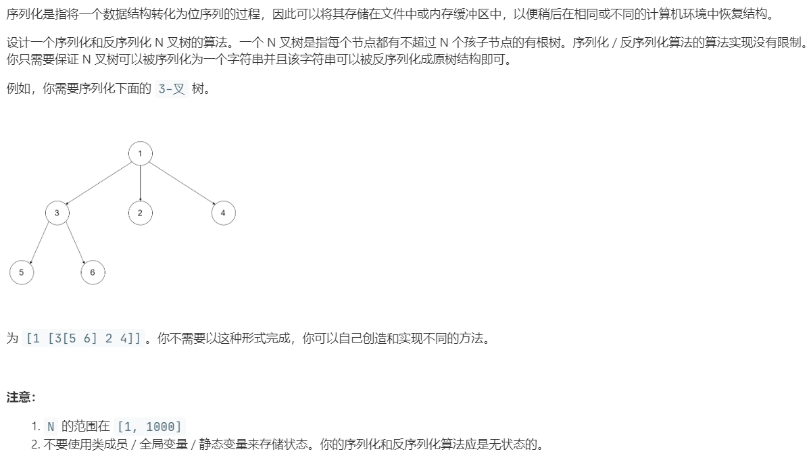

# 428.序列化和反序列化 N 叉树 (Hard)

## 题目描述



## 思路 & 代码

序列化的话用前序遍历就行，不过想了一下好像用迭代比较难实现，因为需要判断当前结点是否是父节点的最后一个子结点才能决定是否加上边界字符。那还是用递归吧。

```c++
class Codec {
public:
    // Encodes a tree to a single string.
    string serialize(Node* root) {
        if(root == nullptr) {
            return "";
        }
        string res;
        res = to_string(root->val);
        if(!root->children.empty()) {
            res += " [ ";
            auto iter = root->children.begin();
            for(; iter + 1 != root->children.end(); iter++) {
                if(*iter != nullptr) {
                    res += serialize(*iter) + " ";
                }
            }
            res += serialize(*iter);
            res += " ]"; 
        }
        return res;
    }
	// 1 [ 3 [ 5 6 ] 2 4 ]
    // Decodes your encoded data to tree.
    Node* deserialize(string data) {
        if(data.length() == 0) {
            return nullptr;
        }
        stringstream ss(data);
        stack<Node*> st;
        Node* root = nullptr;
        auto cur = root;
        string s;
        while(ss >> s) {
            if(s == "[") {
                st.push(cur);
            }else if(s == "]") {
                st.pop();
            }else {
                auto p = new Node(stoi(s));
                if(root == nullptr) {
                    root = p;
                }else {
                    auto parent = st.top();
                    parent->children.push_back(p);
                }
                cur = p;
            }
        }
        return root;
    }
};
```