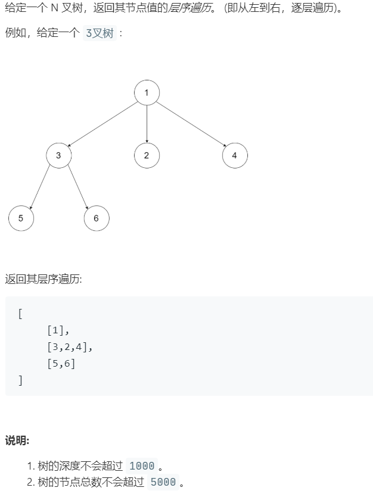

# 429.N 叉树的层序遍历 (Easy)

## 题目描述



## 思路 & 代码

层序遍历是最简单的了，队列就完事了！

```c++ tab="bfs"
class Solution {
public:
    vector<vector<int>> levelOrder(Node* root) {
        vector<vector<int>> res;
        if(root == nullptr) {
            return res;
        }
        vector<int> curLevel;
        queue<Node*> q;
        q.push(root);
        while(!q.empty()) {
            int len = q.size();
            while(len--) {
                auto cur = q.front();
                q.pop();
                curLevel.push_back(cur->val);
                if(!cur->children.empty()) {
                    for(auto i : cur->children) {
                        if(i != nullptr) {
                            q.push(i);
                        }
                    }
                }
            }
            res.push_back(curLevel);
            curLevel.clear();
        }
        return res;
    }
};
```