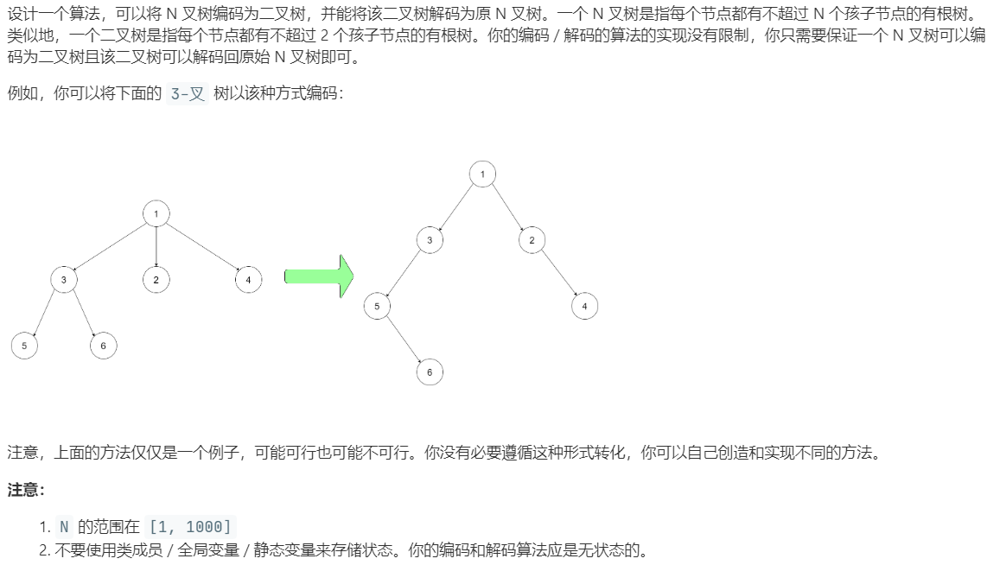

# 431.将 N 叉树编码为二叉树 (Hard)

## 题目描述



## 思路 & 代码

这个示例就是来捣乱的，不用按照它这个规则转换，就直接左孩子右兄弟就完事了。

dfs 比较简单，递归形式：

- N 叉树转二叉树，对当前结点 root，创建对应的二叉树根结点 binaryRoot，binaryRoot->left 指向 root->children[0] 创建的二叉树结点，root->children 使用右指针连城链表。
- 二叉树转 N 叉树，对当前结点 root，创建对应的 N 叉树根结点 naryRoot，将以 root->left 为头结点，right 指针链接的链表结点创建的 N 叉树结点填入 naryRoot->children。

bfs 就用队列，其实也比较简单，但感觉写的时候比较懵：

- N 叉转二叉，维护一个 pair<TreeNode*, Node*> 的队列，先把根结点 root 和对应的二叉树根结点 binaryRoot 入队，将 root->children 中的结点用 right 指针链接，头结点作为 binaryRoot 的左结点。
- 二叉转 N 叉，维护 pair<Node*, TreeNode*> 的队列，每步将以 TreeNode*->left 为链表头，right 链接的链表填入 Node*->children。

```c++ tab="dfs"
class Codec {
public:
    // Encodes an n-ary tree to a binary tree.
    TreeNode* encode(Node* root) {
        if(root == nullptr) {
            return nullptr;
        }
        auto binaryRoot = new TreeNode(root->val);
        TreeNode* cur = nullptr;
        auto& ch = root->children;
        int n = ch.size();
        if(n != 0) {
            binaryRoot->left = encode(ch[0]);
            cur = binaryRoot->left;
            for(int i = 1; i < n; i++) {
                cur->right = encode(ch[i]);
                cur = cur->right;
            }
        }
        return binaryRoot;
    }
	
    // Decodes your binary tree to an n-ary tree.
    Node* decode(TreeNode* root) {
        if(root == nullptr) {
            return nullptr;
        }
        auto naryRoot = new Node(root->val);
        auto ch = root->left;
        while(ch != nullptr) {
            naryRoot->children.push_back(decode(ch));
            ch = ch->right;
        }
        return naryRoot;
    }
};
```

```c++ tab="bfs"
class Codec {
public:
    // Encodes an n-ary tree to a binary tree.
    TreeNode* encode(Node* root) {
        if(root == nullptr) {
            return nullptr;
        }
        auto binaryRoot = new TreeNode(root->val);
        queue<pair<TreeNode*, Node*>> q;
        q.push(make_pair(binaryRoot, root));
        // 每一步取 Node*->children 创建并通过 right 指针连成链表
        // 链表头作为 TreeNode* 的左结点
        while(!q.empty()) {
            auto curRoot = q.front().first;
            auto& ch = q.front().second->children;
            q.pop();
            TreeNode* prev = nullptr;
            auto head = prev;
            for(auto& c : ch) {
                auto p = new TreeNode(c->val);
                if(prev != nullptr) {
                    prev->right = p;
                }else {
                    head = p;
                }
                prev = p;
                q.push(make_pair(p, c));
            }
            curRoot->left = head;
        }
        return binaryRoot;
    }
	
    // Decodes your binary tree to an n-ary tree.
    Node* decode(TreeNode* root) {
        if(root == nullptr) {
            return nullptr;
        }
        auto naryRoot = new Node(root->val);
        queue<pair<Node*, TreeNode*>> q;
        q.push(make_pair(naryRoot, root));
        while(!q.empty()) {
            auto curRoot = q.front().first;
            auto firstChild = q.front().second->left;
            q.pop();
            auto cur = firstChild;
            while(cur != nullptr) {
                auto p = new Node(cur->val);
                curRoot->children.push_back(p);
                q.push(make_pair(p, cur));
                cur = cur->right;
            }
        }
        return naryRoot;
    }
};
```