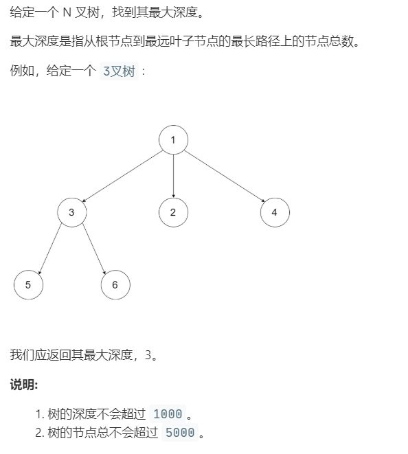

# 559.N 叉树的最大深度 (Easy)

## 题目描述 



## 思路 & 代码

简单的递归，递归求子树的最大深度 + 1。

```c++ tab="递归"
class Solution {
public:
    int maxDepth(Node* root) {
        if(root == nullptr) {
            return 0;
        }
        int maxChildDepth = 0;
        if(!root->children.empty()) {
            for(auto p : root->children) {
                maxChildDepth = max(maxChildDepth, maxDepth(p));
            }
        }
        return maxChildDepth + 1;
    }
};
```