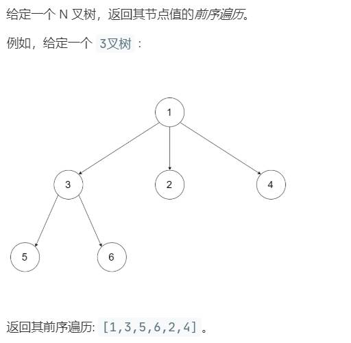

# 589.N 叉树的前序遍历 (Easy)

## 题目描述



## 思路 & 代码

前序遍历，就先访问根，在递归地访问子结点。

递归很简单，跟二叉树没啥区别。

迭代就肯定要用栈了，二叉树的遍历是先找到最左节点，找的过程中先访问根节点，每次将右结点入栈。

```c++ tab="递归"
class Solution {
private:
    vector<int> res;
    void helper(Node *root) {
        res.push_back(root->val);
        if(root->children.size() != 0) {
            for(auto& cur : root->children) {
                helper(cur);
            }
        }
    }
public:
    vector<int> preorder(Node* root) {
        if(root == nullptr) {
            return res;
        }
        helper(root);
        return res;
    }
};
```

```c++ tab="迭代"
class Solution {
public:
    vector<int> preorder(Node* root) {
        vector<int> res;
        if(root == nullptr) {
            return res;
        }
        stack<Node*> st;
        st.push(root);
        while(!st.empty()) {
            auto cur = st.top();
            st.pop();
            res.push_back(cur->val);
            auto& ch = cur->children;
            if(!cur->children.empty()) {
                // 子结点倒序入栈
                for(auto iter = ch.rbegin(); iter != ch.rend(); iter++) {
                    if(*iter != nullptr) {
                        st.push(*iter);
                    }
                }
            }
        }
        return res;
    }
};
```

