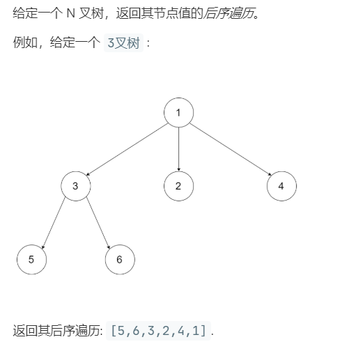

# 590.N 叉树的后序遍历 (Easy)

## 题目描述



## 思路 & 代码

后序遍历就是先递归遍历子结点最后访问根结点，N 叉树的话如果像二叉树那样记录前一个结点就很麻烦（我也不会。

前序遍历子结点时倒着入栈的，后序就正着入栈，最后的序列再 reverse 就得到了后序遍历。

```c++ tab="递归"
class Solution {
private:
    vector<int> res;
    void helper(Node *root) {
        if(root == nullptr) {
            return;
        }
        if(!root->children.empty()) {
            for(auto iter = root->children.begin(); iter != root->children.end(); iter++) {
                if(*iter != nullptr) {
                    helper(*iter);
                }
            }
        }
        res.push_back(root->val);
    }
public:
    vector<int> postorder(Node* root) {
        if(root == nullptr) {
            return res;
        }
        helper(root);
        return res;
    }
};
```

```c++ tab="迭代"
class Solution {
public:
    vector<int> postorder(Node* root) {
        vector<int> res;
        if(root == nullptr) {
            return res;
        }
        stack<Node*> st;
        st.push(root);
        while(!st.empty()) {
            auto cur = st.top();
            st.pop();
            res.push_back(cur->val);
            auto& ch = cur->children;
            if(!cur->children.empty()) {
                // 倒序入栈
                for(auto iter = ch.begin(); iter != ch.end(); iter++) {
                    if(*iter != nullptr) {
                        st.push(*iter);
                    }
                }
            }
        }
        reverse(res.begin(), res.end());
        return res;
    }
};
```