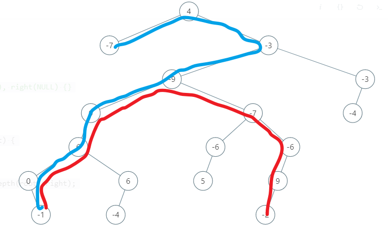

# 543.二叉树的直径 (Easy)

## 题目描述

给定一棵二叉树，你需要计算它的直径长度。一棵二叉树的直径长度是任意两个结点路径长度中的最大值。这条路径可能穿过根结点。

### 示例

> 给定二叉树

```
          1
         / \
        2   3
       / \
      4   5
```

> 返回  3, 它的长度是路径 [4,2,1,3] 或者  [5,2,1,3]。

### 注意

两结点之间的路径长度是以它们之间边的数目表示。

## 代码

乍一看，应该就是求左右子树的最大深度之和。提交之后单纯的我受到了惊吓：

```
[4,-7,-3,null,null,-9,-3,9,-7,-4,null,6,null,-6,-6,null,null,0,6,5,null,9,null,null,-1,-4,null,null,null,-2]
```



我找到的是蓝色的，但是答案应该是红色的。对于任意一个结点都应该记录以此为根的左右子树深度。

```c++ tab="错误解答"
class Solution {
public:
    int diameterOfBinaryTree(TreeNode* root) {
        if(root == nullptr) {
            return 0;
        }
        return getDepth(root->left) + getDepth(root->right);
    }
    int getDepth(TreeNode *root) {
        if(root == nullptr) {
            return 0;
        }
        return max(getDepth(root->left), getDepth(root->right)) + 1;
    }
};
```

```c++ tab="递归求每个结点的深度"
class Solution {
public:
    int diameterOfBinaryTree(TreeNode* root) {
        if(root == nullptr) {
            return 0;
        }
        int res = 0;
        maxDepth(root, res);
        return res;
    }
    int maxDepth(TreeNode *root, int& res) {
        if(root == nullptr) {
            return 0;
        }
        int l = maxDepth(root->left, res);
        int r = maxDepth(root->right, res);
        res = (l + r > res ? l + r : res);
        return l > r ? l + 1 : r + 1;
    }
};
```
