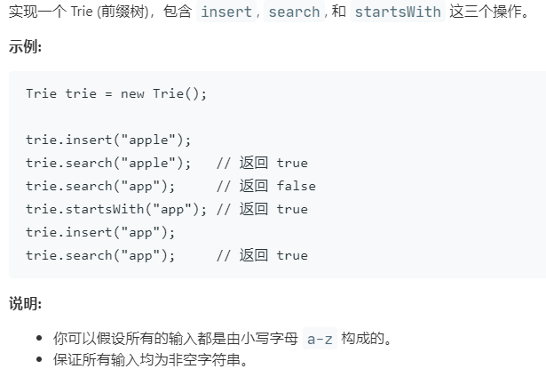

# 208.实现 Trie (前缀树) (Medium)

## 题目描述



### 标签

字典树；

## 思路 & 代码

search 和 startsWith 就是一个搜索单词，一个搜索前缀，在结点中添加一个标记以判断当前结点的字符串是否是单词。

这是用数组实现的，也可以用哈希表。

```c++
class Trie {
private:
    bool isEnd;
    vector<Trie*> next;
public:
    /** Initialize your data structure here. */
    Trie() : isEnd(false), next(vector<Trie*>(26, nullptr)) {}
    
    Trie(bool _isEnd) : isEnd(_isEnd), next(vector<Trie*>(26, nullptr)) {}
    
    /** Inserts a word into the trie. */
    void insert(string word) {
        auto root = this;
        for(auto& c : word) {
            if(root->next[c - 'a'] == nullptr) {
                root->next[c - 'a'] = new Trie();
            }
            root = root->next[c - 'a'];
        }
        root->isEnd = true;
    }
    
    /** Returns if the word is in the trie. */
    bool search(string word) {
        auto root = this;
        for(auto& c : word) {
            root = root->next[c - 'a'];
            if(root == nullptr) {
                return false;
            }
        }
        return root->isEnd;
    }
    
    /** Returns if there is any word in the trie that starts with the given prefix. */
    bool startsWith(string prefix) {
        auto root = this;
        for(auto& c : prefix) {
            root = root->next[c - 'a'];
            if(root == nullptr) {
                return false;
            }
        }
        return true;
    }
};

/**
 * Your Trie object will be instantiated and called as such:
 * Trie* obj = new Trie();
 * obj->insert(word);
 * bool param_2 = obj->search(word);
 * bool param_3 = obj->startsWith(prefix);
 */
```