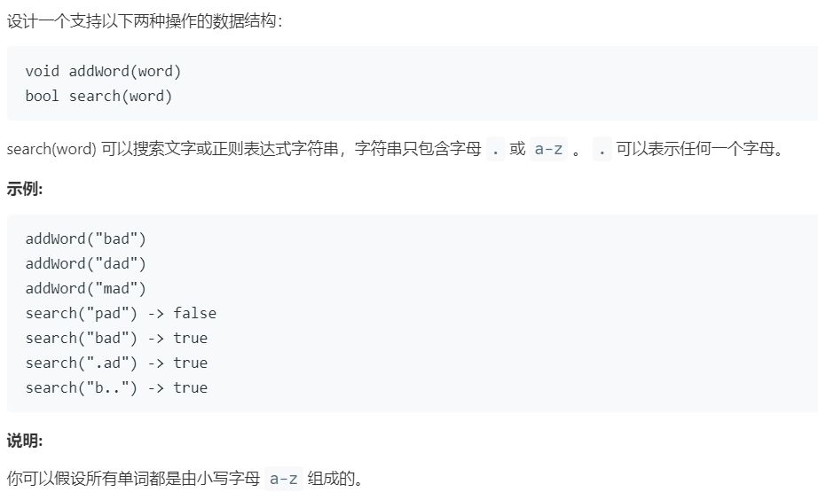

# 211.添加与搜索单词 (Medium)

## 题目描述



### 标签

字典树；回溯算法；

## 思路 & 代码

典型的字典树，只不过加了通配符 `.`，遇到通配符就需要对当前子树进行回溯，直到找到目标字符串或查找失败。

不过感觉涉及到 dfs 的话会比较慢，还可以按照长度放进哈希表，然后直接根据匹配。

```c++ tab="字典树"
class TrieNode {
public:
    bool isEnd;
    vector<TrieNode*> next;
    TrieNode() : isEnd(false), next(vector<TrieNode*>(26, nullptr)) {}
};
class WordDictionary {
private:
    TrieNode* root;
public:
    /** Initialize your data structure here. */
    WordDictionary() {
        root = new TrieNode();
    }
    
    /** Adds a word into the data structure. */
    void addWord(string word) {
        auto cur = root;
        for(auto& c : word) {
            if(cur->next[c - 'a'] == nullptr) {
                cur->next[c - 'a'] = new TrieNode();
            }
            cur = cur->next[c - 'a'];
        }
        cur->isEnd = true;
    }
    
    bool dfs(TrieNode* cur, string& word, int pos) {
        if(cur == nullptr) {
            return false;
        }
        if(pos >= word.length()) {
            return cur->isEnd;
        }
        if(word[pos] == '.') {
            for(auto p : cur->next) {
                if(p != nullptr && dfs(p, word, pos + 1)) {
                    return true;
                }
            }
        }else {
            if(cur->next[word[pos] - 'a'] != nullptr && dfs(cur->next[word[pos] - 'a'], word, pos + 1)) {
                return true;
            }
        }
        return false;
    }
    
    /** Returns if the word is in the data structure. A word could contain the dot character '.' to represent any one letter. */
    bool search(string word) {
        return dfs(root, word, 0);
    }
};

/**
 * Your WordDictionary object will be instantiated and called as such:
 * WordDictionary* obj = new WordDictionary();
 * obj->addWord(word);
 * bool param_2 = obj->search(word);
 */
```

```c++ tab="长度 哈希表"
class WordDictionary {
private:
    unordered_map<int, unordered_set<string>> words;
public:
    /** Initialize your data structure here. */
    WordDictionary() { }
    
    /** Adds a word into the data structure. */
    void addWord(string word) {
        int len = word.length();
        words[len].insert(word);
    }
    
    /** Returns if the word is in the data structure. A word could contain the dot character '.' to represent any one letter. */
    bool search(string word) {
        int len = word.length();
        if(words.count(len) != 0) {
            bool found = false;
            for(auto& s : words[len]) {
                found = true;
                for(int i = 0; i < len; i++) {
                    if(!(word[i] == '.' || word[i] == s[i])) {
                        found = false;
                        break;
                    }
                }
                if(found) {
                    return true;
                }
            }
        }
        return false;
    }
};

/**
 * Your WordDictionary object will be instantiated and called as such:
 * WordDictionary* obj = new WordDictionary();
 * obj->addWord(word);
 * bool param_2 = obj->search(word);
 */
```