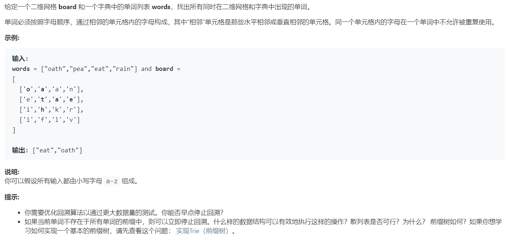

# 212.单词搜索 II (Hard)

## 题目描述



### 标签

回溯算法；

## 思路 & 代码

先复习以下 [单词搜索](../backtracking/79.md)，回溯算法入门题。

如果按照原来的做法，那就遍历单词列表，对每个单词都回溯矩阵。那肯定会有多次遍历重复路径的情况，使用前缀树就是为了避免这种情况。

对所有的单词构造前缀树，然后再用 dfs。

```c++ tab="前缀树 dfs"
class TrieNode {
public:
    string str;
    unordered_map<char, TrieNode*> next;
    TrieNode() : str("") {}
};
class Solution {
private:
    vector<string> res;
    int m, n;
public:
    vector<string> findWords(vector<vector<char>>& board, vector<string>& words) {
        if(board.size() == 0 || board[0].size() == 0 || words.size() == 0) {
            return {};
        }
        TrieNode* root = new TrieNode();
        // 构造前缀树
        auto cur = root;
        for(auto& word : words) {
            cur = root;
            for(auto& c : word) {
                if(!cur->next.count(c)) {
                    cur->next[c] = new TrieNode();
                }
                cur = cur->next[c];
            }
            cur->str = word;
        }
        m = board.size(), n = board[0].size();
        for(int i = 0; i < m; i++) {
            for(int j = 0; j < n; j++) {
                dfs(board, root, i, j);
            }
        }
        return res;
    }
    void dfs(vector<vector<char>>& board, TrieNode* cur, int i, int j) {
        if(cur->str != "") {
            res.push_back(cur->str);
            cur->str = "";
            return;
        }
        if(i >= m || j >= n || i < 0 || j < 0 || !cur->next.count(board[i][j])) {
            return;
        }
        cur = cur->next[board[i][j]];
        board[i][j] ^= 128;
        dfs(board, cur, i + 1, j); 
        dfs(board, cur, i - 1, j);
        dfs(board, cur, i, j + 1);
        dfs(board, cur, i, j - 1);
        board[i][j] ^= 128;
    }
};
```