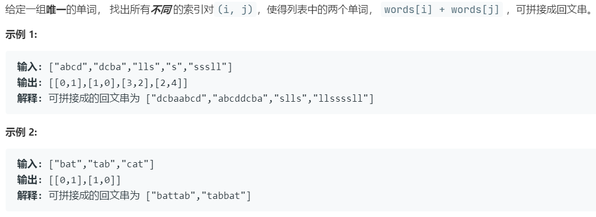

# 336.回文对 (Hard)

## 题目描述



### 标签

字典树；哈希表；

## 思路 & 代码

暴力方法就是对所有的字符串组合判断是否回文。这样肯定是超时的，需要优化，首先考虑所有满足条件的可能：

1. 两个字符串镜像；
2. 空串和回文串；
3. 长度不同，则长字符串必定是由短字符串的反转加上一段回文组成。即对每个字符串，判断前缀或后缀是否回文，回文则将剩余的部分反转看是否在表中。

诶，发现没用字典树就做出来了。。。用字典树的话，应该是把字符串反转后建树，这样对于每个原始字符串，遍历的同时在字典树（后缀树）中查找，如果找到就分两种了，当前的长还是后缀的那个长，前者就判断剩余部分是否回文，后者就在后缀树中接着遍历找到剩余部分回文的串。后缀的回文串可以在构造字典树时填入当前节点。但这样感觉也挺慢的，每一步建树都要判断回文。

```c++ tab="前缀 后缀"
class Solution {
private:
    bool isPalindrome(string& s, int l, int r) {
        while(l < r) {
            if(s[l] != s[r]) {
                return false;
            }
            l++;
            r--;
        }
        return true;
    }
    vector<string> allValidPrefix(string word) {
        vector<string> res;
        int len = word.length();
        for(int i = 0; i < len; i++) {
            if(isPalindrome(word, i, len - 1)) {
                res.push_back(word.substr(0, i));
            }
        }
        return res;
    }
    vector<string> allValidSuffix(string word) {
        vector<string> res;
        int len = word.length();
        for(int i = 0; i < len; i++) {
            if(isPalindrome(word, 0, i)) {
                res.push_back(word.substr(i + 1));
            }
        }
        return res;
    }
public:
    vector<vector<int>> palindromePairs(vector<string>& words) {
        vector<vector<int>> res;
        int n = words.size();
        if(n == 0) {
            return res;
        }
        // 因为要返回下标
        unordered_map<string, int> idx;
        for(int i = 0; i < n; i++) {
            idx[words[i]] = i;
        }
        for(auto& word : words) {
            int curIndex = idx[word];
            string rev = word;
            reverse(rev.begin(), rev.end());
            if(idx.count(rev) && idx[rev] != curIndex) {
                res.push_back({curIndex, idx[rev]});
            }
            auto prefixes = allValidPrefix(word);
            for(auto prefix : prefixes) {
                reverse(prefix.begin(), prefix.end());
                if(idx.count(prefix)) {
                    res.push_back({curIndex, idx[prefix]});
                }
            }
            auto suffixes = allValidSuffix(word);
            for(auto suffix : suffixes) {
                reverse(suffix.begin(), suffix.end());
                if(idx.count(suffix)) {
                    res.push_back({idx[suffix], curIndex});
                }
            }
        }
        return res;
    }
};
```

```c++ tab="字典树"
class TrieNode {
public:
    vector<TrieNode*> next;
    vector<int> suffixes;
    vector<int> words;
    TrieNode() : next(26, nullptr) {};
};
class Solution {
private:
    bool isPalindrome(string& word, int l, int r) {
        while(l < r) {
            if(word[l] != word[r]) {
                return false;
            }
            l++, r--;
        }
        return true;
    }
public:
    TrieNode* buildTrie(vector<string>& words) {
        TrieNode* root = new TrieNode();
        auto cur = root;
        int n = words.size();
        for(int i = 0; i < n; i++) {
            cur = root;
            string tmp = words[i];
            reverse(tmp.begin(), tmp.end());
            int len = tmp.length();
            if(isPalindrome(tmp, 0, len - 1)) {
                cur->suffixes.push_back(i);
            }
            for(int j = 0; j < len; j++) {
                int c = tmp[j] - 'a';
                if(cur->next[c] == nullptr) {
                    cur->next[c] = new TrieNode();
                }
                cur = cur->next[c];
                if(isPalindrome(tmp, j + 1, len - 1)) {
                    cur->suffixes.push_back(i);
                }
            }
            cur->words.push_back(i);
        }
        return root;
    }
    vector<vector<int>> palindromePairs(vector<string>& words) {
        vector<vector<int>> res;
        int n = words.size();
        if(n == 0) {
            return res;
        }
        TrieNode* root = buildTrie(words);
        for(int i = 0; i < n; i++) {
            int j = 0;
            auto cur = root;
            int len = words[i].length();
            for(; j < len; j++) {
                if(isPalindrome(words[i], j, len - 1)) {
                    for(auto& k : cur->words) {
                        if(k != i) {
                            res.push_back({i, k});
                        }
                    }
                }
                int c = words[i][j] - 'a';
                if(cur->next[c] == nullptr) {
                    break;
                }
                cur = cur->next[c];
            }
            if(j == len) {
                for(auto& k : cur->suffixes) {
                    if(k != i) {
                        res.push_back({i, k});
                    }
                }
            }
        }
        return res;
    }
};
```