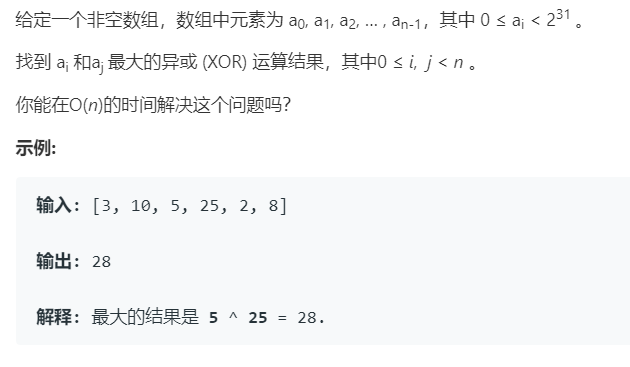

# 421.数组中两个数的最大异或值 (Medium)

## 题目描述



### 标签

字典树；

## 思路 & 代码

看了一会不太懂为啥求异或用字典树，字典树是匹配前缀，整数要匹配的话那应该就得转成二进制之类的。

从高位开始，构造前缀树，之后对每个元素从高位开始在前缀树中搜索，尽可能使最多的高位为 1，最后取最大值。

```c++ tab="前缀树"
class TrieNode {
public:
    TrieNode* next[2] = { nullptr };
};
class Solution {
public:
    int findMaximumXOR(vector<int>& nums) {
        TrieNode* root = new TrieNode;
        auto cur = root;
        // 建树
        for(auto& num : nums) {
            cur = root;
            for(int i = 30; i >= 0; i--) {
                int t = (num >> i) & 1;
                if(cur->next[t] == nullptr) {
                    cur->next[t] = new TrieNode();
                }
                cur = cur->next[t];
            }
        }
        int res = 0;
        int curMax = 0;
        for(auto num : nums) {
            cur = root;
            curMax = 0;
            for(int i = 30; i >= 0; i--) {
                int t = (num >> i) & 1;
                if(cur->next[1 - t] != nullptr) {
                    cur = cur->next[1 - t];
                    curMax += (1 << i);
                }else {
                    cur = cur->next[t];
                }
            }
            res = max(res, curMax);
        }
        return res;
    }
};
```

```c++ tab="哈希"
class Solution {
public:
    int findMaximumXOR(vector<int>& nums) {
        int res = 0;
        int mask = 0;
        for(int i = 30; i >= 0; i--) {
            mask |= 1 << i;
            unordered_set<int> xorRes;
            for(auto& num : nums) {
                xorRes.insert(num & mask);
            }
            int curMax = (res | 1 << i);
            for(auto& t : xorRes) {
                if(xorRes.count(curMax ^ t)) {
                    res = curMax;
                    break;
                }
            }
        }
        return res;
    }
};
```