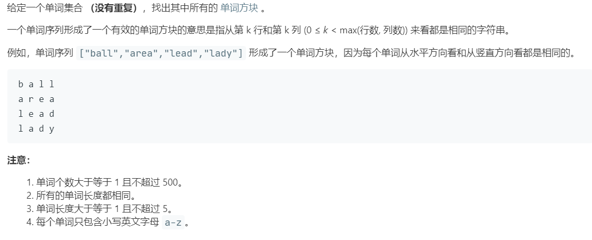

# 425.单词方块 (Hard)

## 题目描述



### 标签

字典树；回溯算法；

## 思路 & 代码

确定一个单词就知道了下一个单词的前缀。示例的 ["ball","area","lead","lady"]，如果确定了第一个为 ball，那么下一个的前缀为 a，即 area，下一个的前缀为 le，即 lead，最后一个前缀为 lad，即 lady。一个方块完成。对整个单词列表回溯即可。搜索前缀时，还需要遍历前缀的子树，找到所有的单词，为了优化这一过程，可以在字典树结点中存当前结点所在的单词，这样在搜索前缀时就可以直接对这些单词进行 dfs 即可。

构造字典树其实比较简单，总犯错就是少了 cur = root 的初始化。。。

```c++ tab="字典树 dfs"
class TrieNode {
public:
    vector<int> idx;
    vector<TrieNode*> next;
    TrieNode() : next(26, nullptr) {}
};
class Solution {
private:
    TrieNode* root;
public:
    void buildTrie(vector<string>& words) {
        root = new TrieNode();
        auto cur = root;
        int len = words.size();
        // 构造字典树
        for(int i = 0; i < len; i++) {
            cur = root;
            for(auto& c : words[i]) {
                if(cur->next[c - 'a'] == nullptr) {
                    cur->next[c - 'a'] = new TrieNode();
                }
                cur = cur->next[c - 'a'];
                cur->idx.push_back(i);
            }
        }
    }
    vector<vector<string>> wordSquares(vector<string>& words) {
        vector<vector<string>> res;
        int len = words[0].length();
        buildTrie(words);
        vector<string> tmp(len);
        for(auto& word : words) {
            tmp[0] = word;
            dfs(res, words, tmp, len, 1);
        }
        return res;
    }
    void dfs(vector<vector<string>>& res, vector<string>& words, vector<string>& tmp, int len, int prefixLen) {
        if(prefixLen >= len) {
            res.push_back(tmp);
            return;
        }
        string prefix(prefixLen, ' ');
        // 画个图就知道前缀该取哪块了
        for(int i = 0; i < prefixLen; i++) {
            prefix[i] = tmp[i][prefixLen];
        }
        auto cur = root;
        for(auto& c : prefix) {
            if(cur->next[c - 'a'] == nullptr) {
                return;
            }
            cur = cur->next[c - 'a'];
        }
        for(auto& i : cur->idx) {
            tmp[prefixLen] = words[i];
            dfs(res, words, tmp, len, prefixLen + 1);
        }
    }
};
```