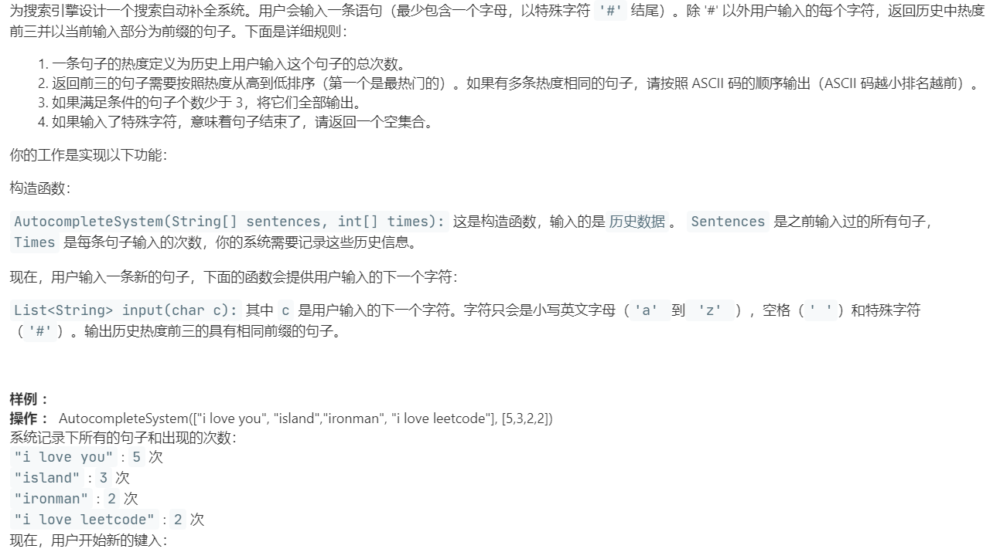
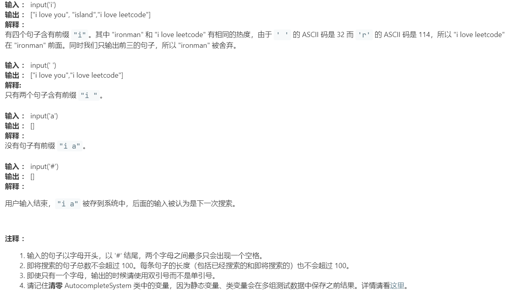

# 642.设计搜索自动补全系统 (Hard)

## 题目描述





### 标签

字典树；

## 思路 & 代码

自动补全肯定是用字典树，以及需要根据热度排序。

感觉就是先建树，然后搜索前缀，把结果根据热度排序，需要注意的是字典树还要有空格，所以还是用哈希表吧。结点里加一个 string 用来记录当前节点对应的句子，感觉这样比较方便。

看到还有用哈希直接映射的，感觉就是仅存了首字母的字典树，会快一些，不用每次都排序。

```c++ tab="前缀树 优先队列"
class TrieNode {
public:
    int times;
    unordered_map<char, TrieNode*> next;
    string sentence;
    TrieNode() : times(0), sentence("") {}
    TrieNode(int _times) : times(_times), sentence("") {}
};

struct cmp {
    bool operator()(const TrieNode* a, const TrieNode* b) {
        return (a->times == b->times ? a->sentence < b->sentence : a->times > b->times);
    }
};

class AutocompleteSystem {
private:
    TrieNode* root;
    TrieNode* cur;
    string sentence;
    priority_queue<TrieNode*, vector<TrieNode*>, cmp> pq;
public:
    AutocompleteSystem(vector<string>& sentences, vector<int>& times) {
        root = new TrieNode();
        cur = nullptr;
        sentence = "";
        // 构造字典树
        int n = sentences.size();
        for(int i = 0; i < n; i++) {
            cur = root;
            auto& sen = sentences[i];
            for(auto &c : sen) {
                if(!cur->next.count(c)) {
                    cur->next[c] = new TrieNode();
                }
                cur = cur->next[c];
            }
            cur->sentence = sen;
            cur->times += times[i];
        }
        cur = root;
    }
    
    vector<string> input(char c) {
        if(c == '#') {
            cur->sentence = sentence;
            sentence = "";
            cur->times++;
            cur = root;
            return {};
        }   
        if(!cur->next.count(c)) {
            cur->next[c] = new TrieNode();
        }
        cur = cur->next[c];
        sentence += c;
        // 遍历从当前节点向下的子树
        queue<TrieNode*> q;
        q.push(cur);
        while(!q.empty()) {
            auto p = q.front();
            q.pop();
            if(p!= nullptr && p->sentence != "") {
                pq.push(p);
                if(pq.size() > 3) {
                    pq.pop();
                }
            }
            if(!p->next.empty()) {
                for(auto iter = p->next.begin(); iter != p->next.end(); iter++) {
                    if(iter->second != nullptr) {
                        q.push(iter->second);
                    }
                }
            }
            
        }
       int i = pq.size();
        vector<string> res(pq.size());
        while(!pq.empty()) {
            // res.insert(res.begin(), pq.top()->sentence);
            res[--i] = pq.top()->sentence;
            pq.pop();
        }
        return res;
    }
};

/**
 * Your AutocompleteSystem object will be instantiated and called as such:
 * AutocompleteSystem* obj = new AutocompleteSystem(sentences, times);
 * vector<string> param_1 = obj->input(c);
 */
```

```c++ tab="一层索引"
class AutocompleteSystem {
public:
    string cur;
    int idx;
    vector<string> res;
    unordered_map<char, map<string, int>> cnt;
    static bool cmp(pair<string, int>& a, pair<string, int>& b){
        if(a.second != b.second)
            return a.second > b.second;
        else
            return a.first < b.first;
    }
    AutocompleteSystem(vector<string>& sentences, vector<int>& times) {
        cur = "";
        idx = 0;
        res.clear();
        cnt.clear();
        // 构造首字母映射
        for(int i = 0; i < sentences.size(); i++)
            cnt[sentences[i][0]][sentences[i]] += times[i];
    }
    vector<string> input(char c) {
        if(c == '#'){
            cnt[cur[0]][cur]++;
            cur = "";
            idx = 0;
            res.clear();
            return res;
        }
        if(idx == 0){
            cur += c;
            idx++;
            // 根据首字母找到所有可能的补全结果
            vector<pair<string, int>> temp;
            for(auto it = cnt[c].begin(); it != cnt[c].end(); it++)
                temp.push_back(*it);
            sort(temp.begin(), temp.end(), cmp);//排序
            for(auto it = temp.begin(); it != temp.end(); it++)
                res.push_back(it->first);
        }
        else{
            auto it = res.begin();
            while(it != res.end()){
                if((*it).size() <= idx || (*it)[idx] != c)
                    res.erase(it);
                else
                    it++;
            }
            cur += c;
            idx++;
        }
        if(res.size() < 3) 
            return res;
        else
            return vector<string>(res.begin(), res.begin()+3);
    }
};

/**
 * Your AutocompleteSystem object will be instantiated and called as such:
 * AutocompleteSystem* obj = new AutocompleteSystem(sentences, times);
 * vector<string> param_1 = obj->input(c);
 */
```