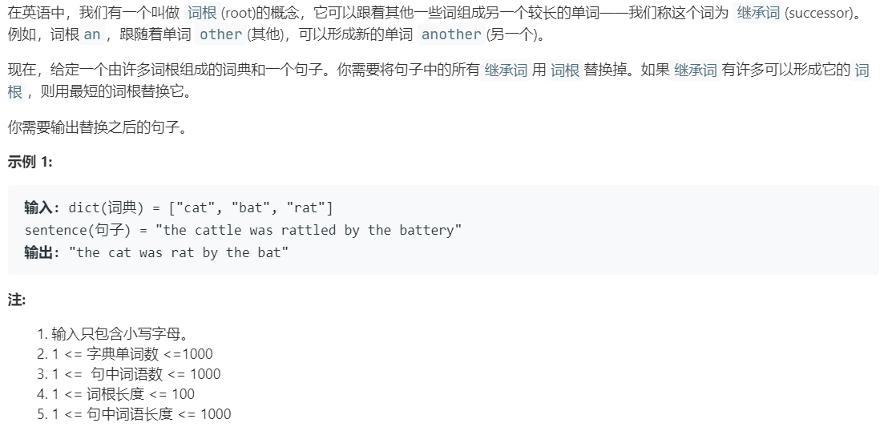

# 648.单词替换 (Medium)

## 题目描述



### 标签

字典树；哈希表；

## 思路 & 代码

前缀匹配，暴力截取前缀判断或字典树。之前都是用的数组，这里用哈希表实现字典树。这里结点里标记的作用是取较短的词根。

```c++ tab="哈希 字典树"
class TrieNode {
public:
    bool flag;
    unordered_map<char, TrieNode*> next;
    TrieNode() : flag(false) {}
};

class Solution {
private:
    TrieNode* root;
public:
    Solution() {
        root = new TrieNode();
    }
    string replaceWords(vector<string>& dict, string s) {
        if(s == "") {
            return "";
        }
        auto cur = root;
        // 构造字典树
        for(auto& word : dict) {
            cur = root;
            for(auto& c : word) {
                if(!cur->next.count(c)) {
                    cur->next[c] = new TrieNode();
                }
                cur = cur->next[c];
            }
            cur->flag = true;
        }
        string res;
        int start = 0;
        int end = 0;
        int len = s.length();
        for(int i = 0; i < len; i++) {
            if(s[i] == ' ') {
                continue;
            }
            cur = root;
            start = i;
            while(i < len && s[i] != ' ') {
                // 匹配词根，取最短词根
                if(cur->flag || !cur->next.count(s[i])) {
                    break;
                }
                cur = cur->next[s[i]];
                i++;
            }
            end = i;
            while(i < len && s[i] != ' ') {
                i++;
            }
            // 没找到词根
            if(!cur->flag) {
                end = i;
            }
            res += s.substr(start, end - start) + " ";
        }
        res.pop_back();
        return res;
    }
};
```

```c++ tab="数组 字典树"
class TrieNode {
public:
    bool flag;
    vector<TrieNode*> next;
    TrieNode() : flag(false), next(vector<TrieNode*>(26, nullptr)) {}
};

class Solution {
private:
    TrieNode* root;
public:
    Solution() {
        root = new TrieNode();
    }
    string replaceWords(vector<string>& dict, string s) {
        if(s == "") {
            return "";
        }
        auto cur = root;
        // 构造字典树
        for(auto& word : dict) {
            cur = root;
            for(auto& c : word) {
                if(cur->next[c - 'a'] == nullptr) {
                    cur->next[c - 'a'] = new TrieNode();
                }
                cur = cur->next[c - 'a'];
            }
            cur->flag = true;
        }
        string res;
        int start = 0;
        int end = 0;
        int len = s.length();
        for(int i = 0; i < len; i++) {
            if(s[i] == ' ') {
                continue;
            }
            cur = root;
            start = i;
            while(i < len && s[i] != ' ') {
                if(cur->flag || cur->next[s[i] - 'a'] == nullptr) {
                    break;
                }
                cur = cur->next[s[i] - 'a'];
                i++;
            }
            end = i;
            while(i < len && s[i] != ' ') {
                i++;
            }
            // 没找到词根
            if(!cur->flag) {
                end = i;
            }
            res += s.substr(start, end - start) + " ";
        }
        res.pop_back();
        return res;
    }
};
```