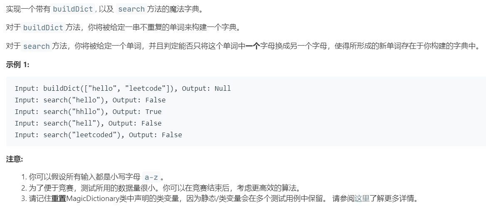

# 676.实现一个魔法字典 (Medium)

## 题目描述



### 标签

字典树；哈希表；

## 思路 & 代码

肯定是先建树，而且一定是要找修改的，不能直接匹配。搜索时用 dfs，传递一个修改标记参数。或者可以在遇到第一个不同的时候，判断字符串剩余部分是否在字典树中。

```c++ tab="字典树"
class TrieNode {
public:
    bool isEnd;
    vector<TrieNode*> next;
    TrieNode() : isEnd(false), next(26, nullptr) {}
    ~TrieNode() {
        for(auto ch : next) {
            if(ch != nullptr) {
                delete ch;
            }
        }
    }
};
class MagicDictionary {
private:
    TrieNode* root;
    void insert(string& word) {
        auto cur = root;
        for(auto& c : word) {
            if(cur->next[c - 'a'] == nullptr) {
                cur->next[c - 'a'] = new TrieNode();
            }
            cur = cur->next[c - 'a'];
        }
        cur->isEnd = true;
    }
    bool search(TrieNode* cur, string& word, int idx, bool isModified) {
        if(cur == nullptr) {
            return false;
        }
        if(idx == word.length()) {
            return isModified && cur->isEnd;
        }
        for(int i = 0; i < 26; i++) {
            if(cur->next[i] != nullptr) {
                if(word[idx] == 'a' + i) {
                    if(search(cur->next[i], word, idx + 1, isModified)) {
                        return true;
                    }
                }else if(!isModified && search(cur->next[i], word, idx + 1, true)) {
                    return true;
                }
            }
        }
        return false;
    }
public:
    /** Initialize your data structure here. */
    MagicDictionary() { }
    
    /** Build a dictionary through a list of words */
    void buildDict(vector<string> dict) {
        root = new TrieNode();
        for(auto& word : dict) {
            insert(word);
        }
    }
    
    /** Returns if there is any word in the trie that equals to the given word after modifying exactly one character */
    bool search(string word) {
        return search(root, word, 0, false);
    }
};

/**
 * Your MagicDictionary object will be instantiated and called as such:
 * MagicDictionary* obj = new MagicDictionary();
 * obj->buildDict(dict);
 * bool param_2 = obj->search(word);
 */
```